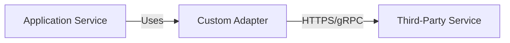

# ADR-[NUMBER]: [SHORT TITLE OF DECISION]

- **Status**: [Proposed | Accepted | Rejected | Deprecated | Superseded]
- **Date**: [YYYY-MM-DD]
- **Author**: [Name / Architect]
- **Affected Diagrams**: [docs/c4/containers.mmd], [docs/integrations/provider.mmd]

---

## 1. Context & Problem Statement

[What problem are we trying to solve? What technical or business forces made this decision necessary?]

---

## 2. Decision

[What is the chosen approach, architecture pattern, technology, or service?]

---

## 3. Diagram Reference

---

## 4. Alternatives Considered & Rejected

### Alternative A: [Option Name]
- **Pros**: [...]
- **Cons**: [...]
- **Reason Rejected**: [...]

### Alternative B: [Option Name]
- **Pros**: [...]
- **Cons**: [...]
- **Reason Rejected**: [...]

---

## 5. Cost Drivers & Trade-Offs

- **Infrastructure / Monetary Cost**: [e.g., $X/month, per-request pricing, additional compute resources]
- **Operational Complexity**: [e.g., monitoring requirements, failure modes, rotation policies]
- **Engineering / Maintenance**: [e.g., development time, testing overhead, abstraction layers]
- **Vendor Dependencies & Lock-in**: [e.g., proprietary SDKs, switching barriers]

---

## 6. Revisit Triggers

[Under what specific conditions or metrics should this decision be reconsidered?]
- [e.g., Monthly traffic exceeds X requests]
- [e.g., Provider increases fees above Y]
- [e.g., Operational maintenance exceeds Z hours/month]
