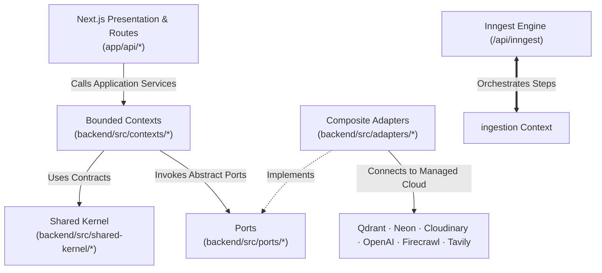

# Architecture Spine — Contextual v1

## Design Paradigm

Contextual is structured as a **Modular Monolith** applying **Ports-and-Adapters (Hexagonal Architecture)** combined with an **Asynchronous Durable Step Pipeline**:
- **Presentation & Controllers (`app/api/`)**: Thin Next.js App Router handlers managing HTTP requests, Clerk session authentication, and SSE streaming.
- **Domain & Application Services (`backend/src/contexts/`)**: Organized strictly by bounded context (`notebooks`, `sources`, `chat`, `ingestion`, `limits`, `telemetry`).
- **Ports (`backend/src/ports/`)**: Pure TypeScript interfaces insulating domain code from third-party vendor SDKs (`VectorStore`, `StorageService`, `Embeddings`, `Search`, `WebExtractor`, `CaptionsService`).
- **Composite Adapters (`backend/src/adapters/`)**: Swappable infrastructure implementations (`QdrantAdapter`, `NeonRepository`, `CloudinaryAdapter`, `OpenAIEmbeddingsAdapter`, `TavilyAdapter`, `FirecrawlAdapter`, `YouTubeCaptionsAdapter`).
- **Asynchronous Execution Backbone (`app/api/inngest/route.ts`)**: Inngest durable step-functions partitioning multi-modal ingestion into sub-5s memoized serverless steps with concurrency limits and failure isolation.
- **Universal Intermediate Representation**: All source modalities normalize into structured **Markdown** prior to chunking and vector indexing.



---

## Invariants & Rules

### AD-1 — Grounded Answer Reasoning & Strict Citation Markup Contract
- **Binds:** `FR-12`, `FR-13`, `FR-15`, `chat` Context
- **Prevents:** Hallucinated citations, ungrounded assistant answers, and citation rendering flicker.
- **Rule:** Assistant completions MUST be synthesized exclusively from retrieved chunks belonging to the active notebook. LLM prompt context strictly wraps chunks with XML tags: `<chunk id="c_123" source="..." page="...">text</chunk>`. The assistant outputs inline citation markers using the strict token syntax `[[C:chunkId]]` immediately following supported statements. If max cosine similarity score `< 0.30` or chunks lack relevant facts, the system triggers an Honest Refusal rather than hallucinating. Client parser converts `[[C:chunkId]]` tokens into sequential Inline Citation Pills (`[1]`, `[2]`) with accessible aria labels.

### AD-2 — Qdrant as Sole System of Record for Chunks & Unified Collection Strategy
- **Binds:** `FR-1`, `FR-2`, `FR-3`, `FR-4`, `FR-5`, `VectorStore` Port, `QdrantAdapter`
- **Prevents:** Memory exhaustion (OOM crashes) on Qdrant Cloud Free Tier (1GB cluster) and dual-write desynchronization.
- **Rule:** Qdrant is the sole system of record for chunk-level data (vector embeddings 1536d, text content, and type-specific metadata). Neon DB stores working metadata (notebooks, source status, counters, chat history) and NEVER stores chunk text. To maximize RAM efficiency on the 1GB cluster, all chunks reside in a single unified collection `contextual_chunks_v1` with indexed keyword fields (`notebookId`, `userId`, `sourceId`). Vector queries filter strictly by `notebookId == currentNotebookId AND userId == currentUserId`. Source deletion executes a filtered delete on `sourceId`; notebook purge deletes by `notebookId`. **No Graph Database** is utilized in this architecture.

### AD-3 — Ephemeral File Ingestion & Zero-Backup Disaster Policy
- **Binds:** Operations, `StorageService` Port, `CloudinaryAdapter`
- **Prevents:** Permanent cloud binary storage costs, asset drift, and backup infrastructure overhead on free tier.
- **Rule:** Uploaded files (PDF binaries, raw media) stored in Cloudinary are **strictly ephemeral**: they exist ONLY during the active ingestion pipeline. As soon as the source is parsed to intermediate Markdown, chunked, and upserted into Qdrant (`status: 'ready'`), an Inngest cleanup step immediately deletes the raw binary from Cloudinary. Users rely exclusively on indexed chunks, chat responses, and generated outputs. No backup infrastructure is provided; on catastrophic vector loss, affected sources are marked `failed` and users are prompted to re-upload.

### AD-4 — Inngest Durable Execution Pipeline (`Input → Markdown → Chunks → Index → Purge Temp`)
- **Binds:** `FR-8`, `FR-9`, `FR-11`, `ingestion` Context, `app/api/inngest/route.ts`
- **Prevents:** Vercel serverless HTTP 10s execution timeouts and dropped background ingestion jobs.
- **Rule:** `POST /api/sources` validates input, immediately inserts a Neon record with `status: 'queued'`, dispatches an Inngest event `source.ingest.*`, and returns HTTP 201 to the client in `< 200ms`. Heavy ingestion executes inside Inngest durable step-functions (`step.run`), partitioned into sub-5s idempotent steps:
  1. `extract-raw-content`: Scrapes web (Firecrawl), downloads PDF binary (Cloudinary), fetches YT captions, or reads text.
  2. `normalize-to-intermediate-markdown`: Converts the raw source into a standardized **Markdown Document** with embedded anchors (`<!-- page: N -->`, `<!-- time: mm:ss -->`, `<!-- link: url -->`).
  3. `chunk-intermediate-markdown`: Splits the standardized Markdown document into ~500 token segments while preserving anchor metadata.
  4. `generate-embeddings`: Batch vector generation (<= 20 chunks via OpenAI embedding endpoint).
  5. `index-qdrant`: Upserts points with payloads to Qdrant collection `contextual_chunks_v1`.
  6. `delete-temp-binary`: Purges the temporary uploaded binary from Cloudinary.
  7. `update-neon-status`: Updates Neon DB record to `ready` with `chunkCount`.
  Per-user concurrency is governed at `concurrency: { key: "event.data.userId", limit: 2 }`.

### AD-5 — Failure Isolation & `onFailure` Error Boundary
- **Binds:** `FR-6`, `FR-10`, `ingestion` Context
- **Prevents:** A single corrupted file or failed third-party API call stalling other ingestions or corrupting active notebooks.
- **Rule:** A failure during ingestion of one source NEVER blocks, corrupts, or delays the ingestion of any other source or the active notebook. Transient errors (HTTP 429, 503, socket timeouts) retry up to 3 times with exponential backoff (`initialInterval: '2s'`). Deterministic errors (HTTP 404, uncaptioned YouTube, corrupt PDF) fail immediately. Upon retry exhaustion or deterministic error, Inngest triggers the `onFailure` hook, which sets `status: 'failed'` and an actionable `errorReason` in Neon, and purges any temporary binary in Cloudinary. Active notebooks and existing `ready` sources remain 100% functional and searchable.

### AD-6 — Universal Markdown Intermediate Format & Deep Original View Hybrid Anchors
- **Binds:** `FR-16`, `FR-17`, `FR-18`, `FR-19`, `SharedKernel`, Showcase UI
- **Prevents:** Cross-modality chunking inconsistencies, brittle character byte offset drift, and verification mismatch.
- **Rule:** **Markdown is the single universal intermediate format across all modalities.** 
  - PDFs convert to Markdown with embedded page delimiters (`<!-- page: N -->`).
  - YouTube videos and `.srt`/`.vtt` subtitles convert to dialogue Markdown with timecode markers (`<!-- time: mm:ss -->`).
  - Web pages (via Firecrawl) convert to clean sanitized Markdown.
  - Text input is stored directly as Markdown.
  
  Chunk points in Qdrant store an exact text snippet (`excerpt: text.slice(0, 160)`) alongside structural locators:
  ```json
  {
    "id": "hash(sourceId + position)",
    "vector": [/* 1536 floats */],
    "payload": {
      "chunkId": "string",
      "sourceId": "string",
      "notebookId": "string",
      "userId": "string",
      "text": "string (~500 tokens)",
      "metadata": {
        "sourceName": "string",
        "excerpt": "string",
        "pageNumber": 14,
        "timestampSeconds": 255,
        "timestampLabel": "04:15",
        "link": "https://..."
      }
    }
  }
  ```
  Deep Original View in the Showcase pane pairs structural locators (`pageNumber`, `timestampSeconds`, `link`) with text-layer substring search for `excerpt`, rendering cyan neo-brutalist focus highlights without depending on fragile byte offsets.

### AD-7 — Serverless-Compatible Multi-Modal Extractors
- **Binds:** `FR-2`, `FR-3`, `FR-4`, `FR-5`, `ingestion` Context
- **Prevents:** Vercel serverless C++ native binary failures and Google API quota exhaustion.
- **Rule:**
  - **PDF:** Extracted page-by-page using a pure-JavaScript serverless parser (`unpdf` / `pdf-parse`) in Inngest `step.run`, converted to Markdown with page delimiters.
  - **YouTube:** Captions fetched keyless via `youtube-transcript` directly from public timedtext tracks (zero Google API keys, zero quota limits), converted to timecoded Markdown. If no captions exist, fails immediately with actionable notice: *"No captions or transcript available for this YouTube video. Try uploading an .srt transcript file."*
  - **Web:** Scraped via Firecrawl API returning sanitized clean markdown.
  - **Subtitles:** `.srt` and `.vtt` parsed into timecode-tagged dialogue Markdown via native regex.

### AD-8 — LangChain Decoupled RAG Architecture
- **Binds:** `FR-12`, `FR-13`, `FR-15`, `chat` Context
- **Prevents:** Coupling to proprietary, non-standard AI frameworks or unmaintained SDKs.
- **Rule:** Grounded chat is orchestrated via standard LangChain packages (`@langchain/core`, `@langchain/openai`, `langchain`) using `RunnableSequence`, `ChatPromptTemplate`, and streaming callbacks. Chat and Embeddings endpoints are independently configured via environment variables (`LLM_BASE_URL`, `LLM_API_KEY`, `LLM_MODEL` and `EMBEDDING_BASE_URL`, `EMBEDDING_API_KEY`, `EMBEDDING_MODEL`), permitting instant swaps across OpenAI-compatible providers without code changes.

### AD-9 — Approval-Gated Web Search Fallback (Tavily)
- **Binds:** `FR-14`, `Search` Port, `TavilyAdapter`
- **Prevents:** Autonomous hallucinated searches, unexpected credit burns, and unverified web synthesis.
- **Rule:** Live web search NEVER triggers autonomously. When notebook chunks cannot answer (retrieval score < 0.30 or insufficient facts), the assistant emits an Honest Refusal banner and presents an interactive fallback card: `[Search Web & Answer (1 Credit)]`. Web search executes strictly upon explicit user click, querying Tavily (top 3 results), synthesizing the answer, and tagging citations distinctly as `[Web: domain.com]`.

### AD-10 — Strict 12:00 AM IST Unified Daily Reset & Credit Governor
- **Binds:** `FR-25`, `limits` Context, Top-Bar UI
- **Prevents:** Clock drift, ambiguous rolling windows, and desynchronization between counters and user expectations.
- **Rule:** Daily user credits reset to **10 credits** at a strict, unified schedule: **12:00 AM Asia/Kolkata (18:30 UTC / 00:00 IST)**. Grounded chat completions consume 1 credit; approved web searches consume 1 credit. Ingestion and browsing consume 0 credits. Remaining credits are tracked in `limit_counters` or dynamically queried. When remaining credits reach 0, the chat composer locks with an informative countdown banner indicating the hours remaining until midnight IST reset.

### AD-11 — Midnight Auto-Deletion Purge Cascade (12:00 AM Asia/Kolkata)
- **Binds:** `FR-27`, `notebooks` Context, Inngest Scheduler
- **Prevents:** Unbounded storage accumulation on free tier cloud services and ghost records.
- **Rule:** Active notebooks carry an automated deletion schedule: **all notebooks auto-delete tonight at 12:00 AM Asia/Kolkata (18:30 UTC / 00:00 IST)**. An auto-deletion notice banner is permanently rendered across the top of `/notebook/[id]`. At 18:30 UTC, an Inngest scheduled cron (`fnMidnightMaintenance`) triggers an atomic cleanup cascade:
  1. Purges vector points from Qdrant where `notebookId` matches active notebooks.
  2. Purges any remaining Cloudinary assets for those notebooks.
  3. Deletes records from Neon operational tables (`notebooks`, `sources`, `chat_messages`).
  4. Resets user credit counters back to 10.

### AD-12 — Telemetry Retention & Midnight OLAP Rollup Processing
- **Binds:** `FR-29`, `FR-30`, `telemetry` Context, Neon DB
- **Prevents:** Database bloat while maintaining long-term historical analytics.
- **Rule:** 
  1. System telemetry is recorded into two operational Neon tables during the day: `telemetry_chat_prompts` (tracks prompt length, user/notebook ID, credit cost; no prompt text) and `telemetry_file_uploads` (tracks file type, byte size, user/notebook ID).
  2. At **12:00 AM IST (18:30 UTC)** during the midnight maintenance run, an OLAP aggregation task computes daily summary metrics for the concluding 24-hour cycle and inserts a single consolidated record into `telemetry_daily_aggregates`:
     ```sql
     INSERT INTO telemetry_daily_aggregates (
       summary_date, total_prompts, total_credits_consumed, 
       total_prompt_chars, total_file_uploads, total_upload_bytes, 
       active_users_count, uploads_by_type
     ) VALUES (...);
     ```
  3. Operational prompt and upload rows for the concluded day can then be purged to preserve Neon storage limits while keeping high-level analytical history intact. Third-party analytics scripts (Mixpanel, Hotjar, Google Analytics) remain strictly prohibited.

### AD-13 — Modular Monolith Boundary & Top-Level `backend/` Tree
- **Binds:** Project Organization, All Contexts
- **Prevents:** Spaghetti coupling between Next.js UI controllers and domain business logic.
- **Rule:** Next.js App Router owns routing, authentication middleware, and presentation only. All domain entities, bounded context services, ports, and composite adapters reside in the top-level `backend/src/` directory. No domain logic or direct database queries inside React components.

### AD-14 — Sliding Chat History Window (7 Turns)
- **Binds:** `FR-15`, `chat` Context
- **Prevents:** Unbounded token growth and context window blowup.
- **Rule:** Only the last 7 conversation turns (user + assistant) are pulled from Neon and injected into the LLM context. Full conversation history is retained in Neon for client pagination, but older messages are excluded from the active LLM prompt.

### AD-15 — Storage Quotas & Governance Envelopes
- **Binds:** `FR-26`, `notebooks` Context, `sources` Context
- **Prevents:** Free tier infrastructure quota exhaustion.
- **Rule:** Hard server-side caps: max 10 notebooks per user, max 10 sources per notebook, max 30 sources per user, max 10MB per PDF upload, max 5MB for transcript files. Attempted violations return HTTP 422 with an actionable modal.

### AD-16 — Upgraded Neo-Brutalist Design Tokens & Tri-Pane Layout
- **Binds:** `FR-20`, `FR-21`, `FR-22`, `FR-23`, Frontend UI
- **Prevents:** UI drift and accessibility non-compliance.
- **Rule:** Desktop (≥1280px) renders persistent 3-column split (`Sources 25% | Chat 45% | Showcase 30%`). Mobile (<768px) renders single tabbed pane `[Sources | Chat | Showcase]`. Slanted buttons use `-6deg` skew with `6px -6px` solid ink offset shadow. Colors: Brand Yellow (`#FFE500`), Citation Cyan (`#00E5FF`), Deep Ink (`#111111`), Canvas (`#F4F4F0`). Meets WCAG 2.2 AA in light and dark modes.

---

## Consistency Conventions

| Concern | Convention |
| --- | --- |
| **Identifiers** | Prefixed UUIDs: `nb_*` (Notebook), `src_*` (Source), `chk_*` (Chunk), `msg_*` (Chat Message) |
| **Intermediate Format** | Standardized Markdown with anchor comments (`<!-- page: N -->`, `<!-- time: mm:ss -->`) |
| **Dates & Timestamps** | ISO-8601 strings in UTC (`YYYY-MM-DDTHH:mm:ss.sssZ`); SQL timestamps with timezone |
| **Inngest Event Names** | `source.ingest.<modality>` (`text`, `web`, `pdf`, `transcript`, `youtube`), `cron(30 18 * * *)` (12:00 AM IST maintenance) |
| **Error Shape** | `{ error: { code: string, message: string, details?: Record<string, unknown> } }` |
| **Citation Token Format** | `[[C:chunkId]]` emitted by LLM; parsed on-the-fly to `<CitationPill number={N} chunkId={...} />` |
| **Logging & Telemetry** | Operational Neon tables `telemetry_*` aggregated into `telemetry_daily_aggregates` at 12:00 AM IST |

---

## Stack (Verified & Pinned)

| Layer / Dependency | Version | Purpose |
| --- | --- | --- |
| **Next.js** | `^16.0.0` (App Router) | Web application framework and serverless route handlers |
| **React** | `^19.0.0` | UI component library with concurrent streaming |
| **TypeScript** | `7.0.2` | Type system across frontend and backend |
| **LangChain** | `^0.3.0` (`@langchain/core`, `@langchain/openai`, `langchain`) | RAG runnable sequences, prompt templates, streaming callbacks |
| **Inngest** | `^3.0.0` (`inngest`) | Durable background workflows, step memoization, and scheduled crons |
| **Clerk** | `^5.0.0` (`@clerk/nextjs`, `@clerk/types`) | User authentication and session management |
| **Neon Serverless** | `^0.9.0` (`@neondatabase/serverless`) | Relational PostgreSQL for metadata, limits, and telemetry |
| **Qdrant Cloud** | REST client (`@qdrant/js-client-rest`) | Vector database: sole system of record for chunks (single collection `contextual_chunks_v1`) |
| **Cloudinary** | `^2.0.0` (`cloudinary`) | Temporary binary blob storage during active ingestion only |
| **Firecrawl API** | HTTP client | Web URL content extraction to clean markdown |
| **YouTube Captions** | `youtube-transcript` | Keyless public subtitle cue extraction to timecoded markdown |
| **PDF Parser** | `unpdf` / `pdf-parse` | Pure-JavaScript serverless page text extraction to paginated markdown |
| **TanStack Query** | `^5.101.4` | Client data fetching, optimistic state, and query caching |
| **Tailwind CSS** | `^4.3.0` | Neo-brutalist styling system |
| **Driver.js** | `^1.0.0` | First-run interactive onboarding tour |

---

## Capability → Architecture Map

| Capability Area | Lives in | Governed by |
| --- | --- | --- |
| Multi-Modal Ingestion (Text, Web, PDF, SRT, YouTube) | `backend/src/contexts/ingestion/` | `AD-4`, `AD-5`, `AD-6`, `AD-7` |
| Scoped Vector Search & Chunk Authority | `backend/src/adapters/qdrant/` | `AD-2`, `AD-3`, `AD-6` |
| Grounded Chat & Citation Engine | `backend/src/contexts/chat/` | `AD-1`, `AD-6`, `AD-8`, `AD-14` |
| Honest Refusal & Web Search Fallback | `backend/src/adapters/tavily/` | `AD-9` |
| Deep Original View Showcase | `components/showcase/` | `AD-6`, `AD-16` |
| Daily Credit Governor (10 credits/day, 12 AM IST reset) | `backend/src/contexts/limits/` | `AD-10` |
| Midnight Auto-Deletion & Ephemeral Lifecycle | `backend/src/contexts/notebooks/` | `AD-11`, `AD-15` |
| Operational Telemetry & OLAP Aggregates | `backend/src/contexts/telemetry/` | `AD-12` |
| Workspace Tri-Pane UI & Neo-Brutalist System | `components/` & `app/` | `AD-13`, `AD-16` |

---

## Deferred

The following items are intentionally deferred beyond v1:
- **Audio-only speech-to-text:** Custom Whisper speech transcription for `.mp3`/`.wav` files (users must provide `.srt`/`.vtt` or captioned YouTube URLs in v1).
- **Multi-user collaboration:** Shared notebooks, presence indicators, real-time co-editing (v1 is strictly single-user per Clerk ID).
- **Permanent binary asset hosting:** No long-term file hosting; raw binaries are removed post-ingestion, users rely on chunks/chat.
- **Automated Qdrant snapshot backup pipelines:** Not cost-justified on free tier; disaster recovery uses re-upload policy.
- **Hybrid sparse-dense BM25 re-ranking:** Pure cosine similarity (`topK=5`, `minScore=0.30`) is sufficient for v1 notebook scope.
- **Paid subscriptions & credit purchase flows:** Hard cap of 10 daily credits is strictly enforced without payment gateways in v1.
