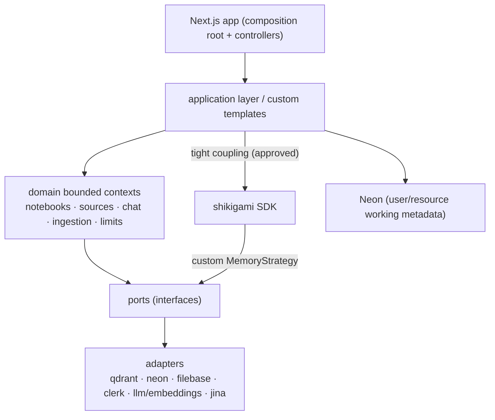
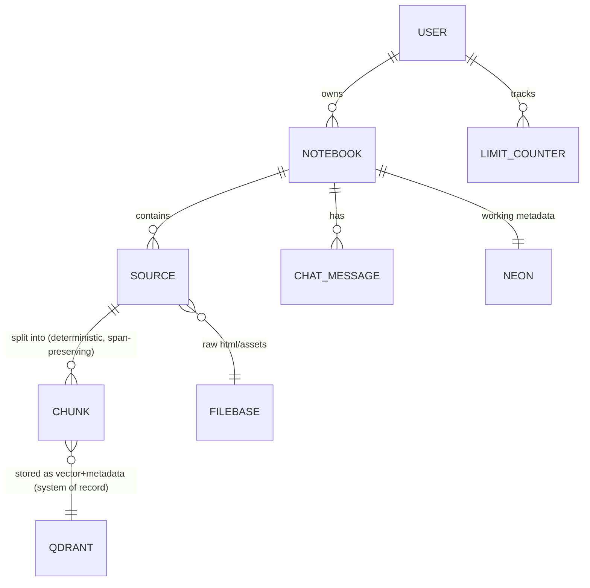
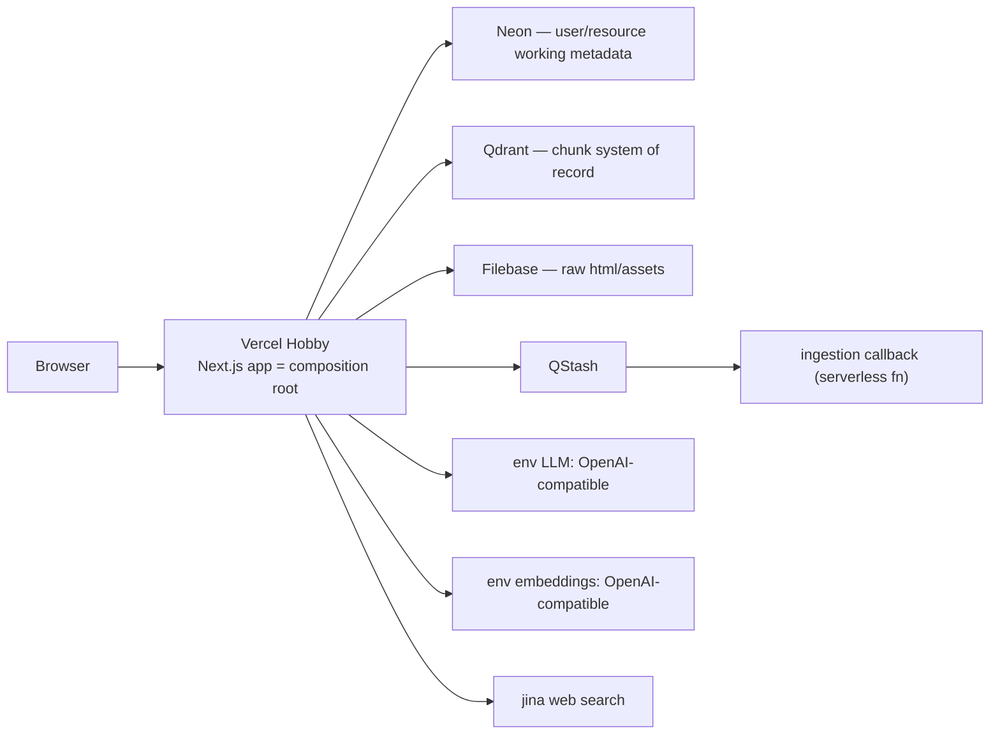

# Architecture Spine — chaibookLM v0.1

## Design Paradigm

**Ports-and-adapters (hexagonal) modular monolith over DDD bounded contexts.**

- The domain lives in a separate top-level `backend/` tree as bounded contexts (`notebooks`, `sources`, `chat`, `ingestion`, `limits`). Domain code depends only on **ports** (interfaces); never on infrastructure.
- **Adapters** (Qdrant, Neon, Filebase, Clerk, LLM/embeddings, jina search) are injected at the composition root.
- **Next.js is the composition root and controller layer only** — it wires adapters into ports, exposes HTTP/serverless entry points, and holds no business logic. The whole thing ships as **one deployable** (Vercel Hobby); `backend/` stays a separate tree so it can be extracted into its own service later without a structural refactor.
- **Carve-out (approved):** the shikigami agent SDK is **tightly coupled** into the application — not behind a port. The ports-and-adapters rule applies to storage, vector DB, LLM, embeddings, and web search; it does **not** apply to the answer runtime.



## Invariants & Rules

### AD-1 — Chunk data authority: Qdrant is the system of record for Chunks

- **Binds:** FR-4, FR-5, FR-8, FR-9; `ingestion`, `chat`, `sources` contexts; `VectorStore` port.
- **Prevents:** the split-store drift where a chunk exists in Neon but not Qdrant (or vice versa) and nobody owns the truth.
- **Rule:** A Chunk lives **only** in Qdrant — vector and metadata (`sourceId`, `notebookId`, `span`, `position`, `text`) stored together on the Qdrant document. Neon stores **user + resource working metadata only** (notebooks, source records/status, limits, chat). No chunk-level data is ever written to Neon. **Carve-out:** the AD-9 resolved-citation snapshot (chunkId + sourceId + span) is a rendering artifact for old messages, not chunk content. `[ADOPTED]`

### AD-2 — Recovery: no rebuild on Qdrant loss

- **Binds:** all chunk/vector consumers; `StorageService`; ops.
- **Prevents:** an unbounded, uncertain re-index operation after vector-store loss.
- **Rule:** Qdrant loss is **not** repaired by replaying ingestion. Approved recovery: delete the affected users' resource files from Filebase and surface an honest error (FR-13 tone). v0.1 carries **zero backup posture** — no snapshots, no loss alerting. `[ADOPTED]`

### AD-3 — shikigami is coupled, not ported

- **Binds:** `chat`, `ingestion`, all shikigami usage.
- **Prevents:** a false abstraction over the answer runtime, and unapproved SDK changes.
- **Rule:** Application code depends directly on `@glitch-guy0/shikigami`. Any modification to the SDK itself (new templates, changed behavior) requires a detailed change-request document and explicit approval before implementation. Custom strategies/templates implemented on top of the SDK are app code and need no approval. `[ADOPTED]`

### AD-4 — Single writer for the chunk lifecycle

- **Binds:** `ingestion` (writer), `chat` (reader), `sources` (reads status only).
- **Prevents:** orphaned vectors and divergent delete paths.
- **Rule:** Only the ingestion context creates chunks and removes them. Qdrant chunk documents carry a `sourceId` payload; removal is a **filtered delete on `sourceId`** (every document matching that `sourceId`). No other code path writes to the chunk collection. `[ADOPTED]`

### AD-5 — One embedding model, both sides

- **Binds:** `ingestion`, `chat`/retrieval, `EmbeddingService`.
- **Prevents:** mismatched vector spaces that make retrieval silently return garbage.
- **Rule:** `EmbeddingService` is the only caller of the embeddings endpoint, shared by `SourceIndexer` (chunk vectors) and `VectorStoreMemoryStrategy` (query vectors). The embedding model is OpenAI-compatible and fully env-driven with its own three vars: `EMBEDDING_BASE_URL`, `EMBEDDING_API_KEY`, `EMBEDDING_MODEL` — independent of the LLM env vars. Changing the model is a deliberate re-index event, never a silent config edit. `[ADOPTED]`

### AD-6 — One shared chunk kernel, deterministically split

- **Binds:** `ingestion`, `chat`/retrieval, `CitationMapper`; FR-5, FR-8.
- **Prevents:** writer/reader/citation divergence on the chunk contract.
- **Rule:** One shared type `{chunkId, sourceId, notebookId, span{start,end}, position, text}` (+ vector) is defined once and used by ingestion (writes), retrieval (returns), and `CitationMapper` (resolves). The splitter is **deterministic and span-preserving** — each chunk records its char-span in the original text, powering the FR-8 highlight. `chunkId` is a deterministic hash of `sourceId + position`, so re-runs and QStash retries produce the same id (idempotent upsert, no duplicates). **Chunking algorithm (v0.1):** 500 chars per chunk with 25% overlap for plain-text sources; **heading-aware splitting** for web sources, which arrive as markdown from jina Reader (`r.jina.ai` URL→markdown), so chunks never split mid-section and headings carry structure into the chunk. `[ADOPTED]`

### AD-7 — Citation contract: markers are validated, never trusted

- **Binds:** FR-6, FR-7, FR-8, FR-9; `chat`; SM-1/SM-2 telemetry.
- **Prevents:** hallucinated or stale citations rendering.
- **Rule:** Retrieved chunks enter context keyed by `chunkId`; `GroundedAnswerReasoningStrategy` emits per-sentence inline markers referencing only given `chunkId`s; `CitationMapper` (app-level) validates every marker against the retrieved set (notebook-scoped by construction), drops unknowns, maps survivors to chips + span highlight. Refusal is **structural**: no retrieval above `minScore` → no `chunkId`s in context → the model cannot cite → the "not found in your sources" answer carries zero markers. `[ADOPTED]`

### AD-8 — Retrieval parameters (acceptance-run testable)

- **Binds:** FR-7, FR-6; `VectorStoreMemoryStrategy`; the v0.1 acceptance run.
- **Prevents:** ad-hoc per-story tuning of the refusal gate.
- **Rule:** `topK = 5` chunks into context; `minScore = 0.30` absolute cosine threshold. Retrieval is scoped by `notebookId`, so cross-notebook citations are impossible by construction (FR-6). `[ADOPTED]`

### AD-9 — Chat history window: 7 turns

- **Binds:** FR-6, FR-9; `NotebookSession`, chat UI.
- **Prevents:** unbounded per-turn token cost and full-history loads.
- **Rule:** Exactly the last **7 user+assistant turns** are fed into context per turn (sliding window). A **turn** = one user message + its assistant response (a fetch-on-refusal sub-answer counts as its own turn). The chat list loads the most recent 7 on open and pulls the next 7 upward on scroll. Full history persists in Neon; only the window is re-fed. **Carve-out:** persisted chat messages may carry a resolved-citation **snapshot** (`chunkId` + `sourceId` + span) so old messages render their chips even though chunk data lives only in Qdrant (AD-1). `[ADOPTED]`

### AD-10 — Limits: one counter owner, atomic enforcement

- **Binds:** FR-1, FR-9, §6.1; `limits` context.
- **Prevents:** divergent limit math and cap races.
- **Rule:** The `limits` concern owns all per-user/per-notebook counts in Neon; every write boundary (create notebook, add source, upload) routes through it. Cap check-and-increment is a **single Postgres transaction** per operation. **v0.1 caps:** 10 notebooks/user, 10 sources/notebook, 30 sources/user, 5MB/source, 1-week TTL. **Double-bump guard:** only the write boundary (add-source request) bumps the counter — the async ingestion callback reports results but **never** bumps counts, and delete/TTL paths reconcile counters down exactly once. `[ADOPTED]`

### AD-11 — Notebook TTL is lazy

- **Binds:** FR-1; `limits`, `sources`.
- **Prevents:** scheduler/infra cost for a low-frequency event.
- **Rule:** Expiry check runs on dashboard load and notebook open; expired notebooks are deleted and the user informed (FR-1 wording). No cron in v0.1; a daily sweep is deferred unless stale-expired notebooks become a real problem. `[ADOPTED]`

### AD-12 — Honest degradation scoped to AI/ingestion ops

- **Binds:** FR-13; `chat`, `ingestion`, controllers.
- **Prevents:** broken/erroring UI under load, and unbounded queueing that burns credits.
- **Rule:** An app-layer guard in front of AI/ingestion operations rejects with the "experiencing high load at this time — try again later" message and drops the request. Already-indexed sources and browsing remain usable. Trigger is a configured request-rate threshold on AI/ingestion ops (env-driven). `[ADOPTED]`

### AD-13 — Web search is approval-gated, never unprompted

- **Binds:** FR-7, §5 non-goal; `WebSearchTool`, `chat`.
- **Prevents:** silent external fetches on every refusal, and search firing without the user asking.
- **Rule:** `WebSearchTool` (jina) runs **only** after the user explicitly approves a fetch-on-refusal offer. The model never invokes search autonomously; the controller mediates: refusal answer → user clicks "fetch sources" → approval gate → search runs → fetched pages re-enter via `SourceIndexer` (counts against limits, AD-10) → next turn is grounded. `[ADOPTED]`

### AD-14 — Delete cascade order: Qdrant → Filebase → Neon

- **Binds:** FR-4, AD-2 recovery, AD-4; `ingestion`, `sources`, `limits`.
- **Prevents:** orphan chunks with live citations, or half-deleted resources on failure.
- **Rule:** Removal of a source (user-initiated, bulk, TTL expiry, or Qdrant-loss recovery) follows a **fixed order**: (1) filtered delete on `sourceId` in Qdrant, (2) delete the raw file in Filebase, (3) mark the source record + reconcile counters in Neon. Each step is idempotent and the sequence is owned by the ingestion context (the single writer, AD-4). If a step fails, retry the remaining steps on the next event; in-flight QStash ingestion for a removed source must be able to detect the removal (generation/tombstone check before writing chunks) so a deleted source's chunks never resurrect. `[ADOPTED]`

### AD-15 — Qdrant hosting is a build decision, not a fork

- **Binds:** ops, all Qdrant consumers; AD-2.
- **Prevents:** two divergent Qdrant code paths (cloud vs self-hosted) silently living side by side.
- **Rule:** The Qdrant adapter is written once against the Qdrant client and driven entirely by env config (`QDRANT_URL` + key). Cloud free-tier and self-hosted are **the same adapter, different endpoints** — a config choice, not a code fork. The build picks one hosting target at deploy time. `[ADOPTED]`

### AD-16 — Streaming answers via shikigami events

- **Binds:** FR-7, FR-8; `chat`, `NotebookSession`, the answer runtime.
- **Prevents:** buffering the whole answer before showing anything, and reimplementing streaming by hand.
- **Rule:** Answer delivery is **streaming on** (not async-buffered). The shikigami SDK emits events as tokens are produced; the controller pulls from that stream and forwards deltas to the client. Citation markers stream inline with the answer text. `[ADOPTED]`

## Consistency Conventions

| Concern | Convention |
| --- | --- |
| Naming (bounded contexts) | `notebooks`, `sources`, `chat`, `ingestion`, `limits`; ports named by capability (`VectorStore`, `StorageService`, `search`, `Embeddings`); templates named by the SDK interface they conform to (`*MemoryStrategy`, `*ReasoningStrategy`, `*Session`, `*Tool`) |
| Data & formats | ids are UUIDs (`chunkId`, `sourceId`, `notebookId`); spans are `{start,end}` char offsets in the source's original text; citation marker syntax `[[C:chunkId]]` shared by strategy + mapper; error shape `{message, code}` with FR-13 copy for load rejection |
| State & cross-cutting | mutation only through the owning context (AD-4); all LLM/embedding/search config env-driven (`baseURL`/`apiKey`/`model`), secrets never in client bundles; structured application logging; no raw `fetch` in client components (TanStack Query owns fetching/caching); Chat list + history pagination by 7 (AD-9) |
| Composite adapters | storage/vector/search adapters may compose providers (e.g. web fetch = Filebase + jina) but expose one port; adapters are injected, never constructed by domain code |
| jina endpoints | two endpoints, one `JINA_API_KEY`: `r.jina.ai` (Reader — URL → clean markdown, used for web-source fetch) and `s.jina.ai` (Search — SERP → markdown, top-5, used for fetch-on-refusal); both feed markdown into ingestion → heading-aware split (AD-6) |
| shikigami guardrails | `SimpleInputGuardrail` runs on every `execute()` (sub-agents bypass it — known limitation, SDK change-request if we need to close it); reasoning flows through `ReasoningManager` |
| Kairo templates | Kairo's stock templates are placeholders only — never used in v0.1; the custom set in `templates/` is authoritative (AD-3) |
| QStash payload cap | callback passes a `sourceId` **reference** (small payload), the serverless fn re-fetches source metadata/raw from Neon/Filebase; never the ≤5MB body (QStash ~1MB request cap) |
| Deployment constraint | QStash ingestion callback is a serverless function in the same deployable and must finish inside Vercel Hobby's function-duration cap (~10s default, ~60s max) for ≤5MB sources — monitored risk, not a design out |

## Stack

Seed — versions verified 2026-08-09; the code owns this once it exists.

| Name | Version |
| --- | --- |
| Next.js (App Router) | 16.x |
| React | 19.x |
| TypeScript | 7.x (7.0.2) |
| @glitch-guy0/shikigami | 0.1.0 |
| @tanstack/react-query | 5.x (5.101.4) |
| Tailwind CSS | 4.3.x |
| Clerk | current |
| Qdrant (cloud free tier / self-hosted) | current |
| Neon (Postgres) | current |
| Filebase (S3-compatible) | current |
| Upstash QStash | current |
| react-markdown + remark-gfm | current |
| Driver.js | current |
| jina (search + reader) | current |

## Structural Seed

```text
chaibookLM/
  app/                    # Next.js App Router — UI + route handlers (composition root, controllers)
  backend/
    src/
      contexts/
        notebooks/        # FR-1
        sources/          # FR-2, FR-3, FR-4
        chat/             # FR-6, FR-7, FR-8
        ingestion/        # FR-5; single writer of chunks (AD-4)
        limits/           # FR-1, FR-9, FR-13; counters (AD-10, AD-11)
      shared-kernel/      # chunk shape, citation marker types (AD-6, AD-7)
      ports/              # VectorStore, StorageService, Embeddings, search
      adapters/           # qdrant, neon, filebase, clerk, llm, embeddings, jina
      templates/          # VectorStoreMemoryStrategy, GroundedAnswerReasoningStrategy,
                          # NotebookSession, WebSearchTool, SourceIndexer,
                          # EmbeddingService, CitationMapper (AD-3)
```

### Core entities



### Deployment & environments



Environments: **dev + prod**, config entirely via environment variables, seed data for fresh/test environments.

## Capability → Architecture Map

| Capability / Area | Lives in | Governed by |
| --- | --- | --- |
| FR-1 Notebooks (CRUD, bulk-delete, caps, TTL) | `contexts/notebooks` + `contexts/limits` | AD-9, AD-10, AD-11 |
| FR-2/3 Sources (text + web) | `contexts/sources` | AD-4, AD-6 |
| FR-4 List/remove sources | `contexts/sources` (via ingestion removal) | AD-4 |
| FR-5 Chunk & index | `contexts/ingestion` → Qdrant | AD-1, AD-4, AD-5, AD-6 |
| FR-6 Grounded answers | `contexts/chat` + `VectorStoreMemoryStrategy` + `GroundedAnswerReasoningStrategy` | AD-5, AD-7, AD-8 |
| FR-7 Honest refusal + fetch-on-refusal | `contexts/chat` + `WebSearchTool` (jina) | AD-7, AD-8, AD-12, AD-13 |
| FR-7/FR-8 Streaming delivery | `NotebookSession` + shikigami events → streamed deltas | AD-16 |
| FR-8 Citation → original view | `CitationMapper` + `contexts/sources`/`notebooks` | AD-6, AD-7 |
| FR-9 Auth & persistence | Clerk adapter; Neon (working metadata), Qdrant (chunks) | AD-1, AD-9, AD-10 |
| FR-10 Walkthrough | UI-only (Driver.js), no domain state | UX spec (Deferred) |
| FR-11 Landing + reduced-motion | UI-only, Tailwind tokens | UX spec (Deferred) |
| FR-12 Consent | UI-only (shared persist across devices) | UX spec (Deferred) |
| FR-14 Dark mode | UI-only, Tailwind tokens | UX spec (Deferred) |
| FR-13 Rate-limit rejection | app-layer guard on AI/ingestion ops | AD-12 |
| Web search gate | `WebSearchTool` (jina) + controller mediation | AD-13 |
| Delete cascade | `contexts/ingestion` (single writer) | AD-14 |
| Qdrant hosting | `adapters/qdrant`, env-driven | AD-15 |
| shikigami runtime | `@glitch-guy0/shikigami` (coupled) + `templates/` | AD-3, AD-7 |
| Ingestion pipeline | `SourceIndexer` (QStash job) | AD-4, AD-5, AD-6 |

## Deferred

- **FR-10 walkthrough, FR-11 landing + reduced-motion, FR-12 consent, FR-14 dark mode** — pure UI/presentation (Tailwind tokens + Driver.js), no domain state; governed by the UX spec, not this spine. `binds`/map intentionally exclude them.
- **Qdrant backups/monitoring** — explicitly deferred by AD-2 (zero-backup posture); revisit when the app leaves builder-only.
- **Daily TTL sweep** — deferred by AD-11 unless stale-expired notebooks become a real problem.
- **Model-agnostic retrieval beyond OpenAI-compatible embeddings** — embeddings are env-driven but OpenAI-compatible only (AD-5); non-OpenAI-compatible providers deferred.
- **Standalone search surface** — PRD v0.1 queryable only via chat (JTBD-3); deferred by PRD.
