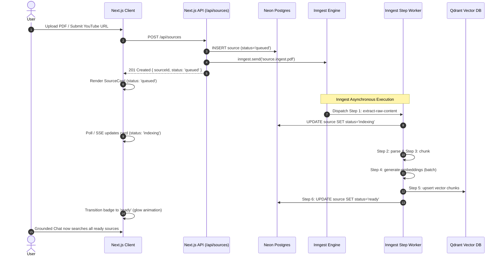

# PRD: Contextual (Gemini Notebook Clone — v1 Direct Production Release)

## 0. Document Purpose & Handoff Context

This Product Requirements Document (PRD) defines the complete functional, technical, architectural, and user interface requirements for **Contextual** v1 Direct Production Release. It acts as the authoritative contract and handoff document across engineering, product management, and UX design:
- **For Winston (System Architect):** Specifies §4 System Architecture & Inngest Durable Execution Model, §5.7 Lightweight Monitoring Layer, and §9 Performance Testing & Concurrency Benchmarking, defining domain context boundaries, Inngest event topologies, step-function schemas, telemetry schema, capacity modeling, and third-party integrations (Firecrawl, Neon, Qdrant, Cloudinary, Inngest, Tavily).
- **For Sally (UX Designer):** Establishes §11 UI Requirements & Downstream Handoff Specification, detailing information architecture, screen hierarchies, neo-brutalist styling rules (slanted buttons, ink borders, solid offset shadows), responsive breakpoints, and micro-interaction states down to 320px viewports.
- **For Amelia (Developer):** Provides globally indexed, acceptance-testable Functional Requirements (§5: FR-1 through FR-30), testable consequences, error boundaries, and developer contracts (debug IDs, accessibility attributes).

Contextual v1 supersedes the initial v0.1 text/web prototype by shipping full multi-modal ingestion (Text, Web, PDF, Transcripts, YouTube), durable Inngest background orchestration, deep Original View verification, and an upgraded neo-brutalist tri-pane workspace directly into production.

> [!IMPORTANT]
> **Ephemeral Notebook Auto-Deletion Notice:**
> Active notebooks in this environment carry an explicit automated deletion schedule: **this notebook will be auto-deleted tonight at 12:00 AM Asia/Kolkata time (UTC+05:30)**. The user interface MUST prominently display this warning so users are fully aware before uploading documents or relying on persistent notes.

---

## 1. Vision

Contextual is a high-velocity, personal research workspace built in the spirit of Google's NotebookLM (Gemini Notebook): users bring their own multi-modal sources and chat with an AI assistant whose answers are grounded strictly in their uploaded material, with every assertion linking directly to verifiable proof in the original asset.

Unlike generic AI assistants that hallucinate or synthesize answers from broad pre-training weights, Contextual enforces strict source isolation. When source material lacks the information to answer a question, the assistant transparently refuses rather than confabulates, offering an approval-gated web search fallback.

Unlike Google NotebookLM, which displays isolated text quote snippets, Contextual's **Deep Original View** closes the citation verification loop by rendering the actual source document in context: jumping to the exact page and highlighted passage in multi-page PDFs, seeking directly to the timestamp in YouTube video lectures and dialogue transcripts, and scrolling to anchored text in live web pages. 

The entire product is wrapped in an upgraded neo-brutalist UI—bold, tactile, functional, and fast—engineered with zero-latency client state and backed by Inngest durable workflows to ensure zero dropped jobs on serverless infrastructure.

---

## 2. Target User

### 2.1 Jobs To Be Done (JTBD)
- **JTBD-1 (Deep Synthesis):** "When I am researching complex multi-source topics (e.g. cross-referencing technical PDFs, web docs, and recorded lectures), I want a single unified notebook that synthesizes findings across modalities, so that I don't lose context switching between browser tabs and note files."
- **JTBD-2 (Audit & Verification):** "When an AI assistant summarizes dense material, I want to click every claim and inspect the exact original sentence, PDF page, or video second mark, so that I can independently verify facts with 100% confidence before citing them in my work."
- **JTBD-3 (Zero-Drop Reliability):** "When I submit large PDFs or long YouTube links, I want background processing that never silently times out or drops my files, with clear visibility into ingestion status and actionable error feedback if a source cannot be parsed."
- **JTBD-4 (Focused Utility):** "When I work inside a research workspace, I want an interface that feels high-energy, tactile, and free of corporate SaaS clutter, responsive whether I am on an ultra-wide desktop or my phone."

### 2.2 Non-Users (v1)
- **Collaborative Enterprise Teams:** Users requiring multi-seat workspaces, live co-editing, shared comments, or role-based access control (RBAC). Contextual v1 is single-user focused.
- **Audio-Only Creators:** Podcasters or interviewers requiring raw audio file transcription (`.mp3`/`.wav` without subtitles). Contextual v1 requires `.srt`/`.vtt` transcript files or YouTube URLs with existing captions.
- **Heavy Document Storage Consumers:** Users expecting an unlimited document archival drive. Contextual enforces strict per-user quotas (10 notebooks, 10 sources/notebook, 10MB/file, 1-week inactivity TTL).

### 2.3 Key User Journeys

#### UJ-1: Elena Audits a Technical AI Architecture Paper
- **Persona + Context:** Elena, a senior staff software engineer studying a new distributed consensus paper while comparing it against an API spec PDF and a conference video.
- **Entry State:** Authenticated via Clerk on desktop Chrome (1440px). Opens an existing notebook or creates a new one named "Consensus Protocols".
- **Path:**
  1. Elena drops a 28-page PDF into the Sources pane and pastes a YouTube keynote URL.
  2. The Sources list displays real-time Inngest status badges (`queued` → `indexing` with orbital neo-brutalist shadow animation → `ready` with brief success glow).
  3. She types: *"How does the leader election handle network partitions during round 3?"*
  4. The assistant streams a grounded response with three inline citation pills: `[1]`, `[2]`, `[3]`.
  5. Elena clicks `[1]`. The right-hand Original View Showcase immediately navigates to page 14 of the embedded PDF viewer and highlights the exact paragraph bounding box in vivid cyan.
  6. She clicks `[3]`. The Showcase dynamically switches to the embedded YouTube player, seeking straight to `18m:42s` with the synchronized transcript dialogue highlighted.
- **Climax:** Elena verifies the exact mechanism in under 5 seconds without leaving her keyboard or manually searching transcripts.
- **Resolution:** Elena copies the verified synthesis into her architectural review notes.
- **Edge Case:** If the YouTube link lacked captions, the source card immediately transitioned to `failed` with a badge: *"No captions found for this video. Please upload an .srt transcript instead."* Other sources remained fully indexed and searchable.

#### UJ-2: Marcus Investigates Market Data on Mobile
- **Persona + Context:** Marcus, an equity research associate commuting on a train, reviewing uploaded quarterly filings and industry articles on an iPhone (390px viewport).
- **Entry State:** Authenticated on mobile Safari. Mobile UI displays the single active view with three top tabs: `[Sources (4)] | [Chat] | [Showcase]`.
- **Path:**
  1. Marcus opens the Chat tab and asks: *"What was the reported cloud gross margin guidance for Q4?"*
  2. The assistant responds with a grounded paragraph ending in citation pill `[1]`.
  3. Marcus taps `[1]`. The interface smoothly auto-switches to the `Showcase` tab, rendering the web article reader scrolled to the highlighted financial table.
  4. At the bottom of the screen, a sticky neo-brutalist floating action button (`← Back to Chat`) is clearly visible.
  5. Marcus taps `← Back to Chat` and is returned precisely to his previous scroll position in the conversation.
- **Climax:** Instant mobile source verification without pinching, zooming, or tab-hunting.
- **Resolution:** Marcus marks the filing as reviewed.

#### UJ-3: Dev Handles Source Gaps with Approval-Gated Web Search
- **Persona + Context:** Dev, a product manager reviewing competitor pricing sheets uploaded to a notebook.
- **Entry State:** Desktop browser, 5 sources indexed.
- **Path:**
  1. Dev asks: *"What is Competitor X's enterprise tier SLA guarantee?"*
  2. The notebook chunks contain pricing tiers but no SLA mentions.
  3. Instead of hallucinating an SLA, the assistant renders an honest refusal card: *"The uploaded sources do not specify Competitor X's enterprise SLA guarantee."*
  4. Directly below the refusal, an interactive fallback card appears: *"Search the live web via Tavily? (Consumes 1 daily credit)"*.
  5. Dev clicks the slanted button: `[Search Web & Answer]`.
  6. The system executes an approval-gated Tavily search, incorporates verified web results, and answers with explicit web citations.
- **Climax:** Complete transparency: zero hallucination, explicit user control over external search and credit expenditure.

---

## 3. Glossary

The following domain terms are authoritative and MUST be used verbatim in all downstream architecture, UI design, code, and documentation:

- **Notebook:** The top-level organizational container for a research topic. Owns an isolated vector collection namespace in Qdrant, a source list in Neon, and an associated chat conversation history. Max 10 per user.
- **Source:** An individual ingested knowledge artifact within a Notebook. Can be of type `TEXT`, `WEB`, `PDF`, `TRANSCRIPT`, or `YOUTUBE`. Max 10 per notebook, 30 per user.
- **Chunk:** A discrete text segment derived from intermediate processed text (~500 tokens), embedded into vectors, and indexed into Qdrant alongside clean, type-specific metadata (PDF: page number, source name; Text: source name; SRT/VTT/YouTube: source name, timestamp, link; Web: source name, link).
- **Grounded Chat:** Conversational interaction where LLM completions are strictly constrained to retrieved Notebook Chunks via system prompt boundaries, requiring sentence-level citation tags (`[[C:chunkId]]`).
- **Inline Citation Pill:** A clickable, non-slanted, high-contrast UI pill rendered at the end of a cited sentence (e.g. `[1]`, `[2]`). Clicking triggers the Original View Showcase.
- **Original View (Showcase):** The dedicated viewer interface (right pane on desktop, dedicated tab on mobile) rendering the true source asset in high fidelity with highlighted span anchoring.
- **Inngest Workflow Engine:** The event-driven, durable workflow orchestration platform serving as Contextual's asynchronous execution backbone on serverless infrastructure, providing step-level idempotency, retries, concurrency limits, and failure isolation.
- **Durable Step Function:** A discrete, resumable unit of execution (`step.run()`) inside an Inngest function whose state and return value are memoized across serverless invocations.
- **Credit Governor:** A per-user daily token allocation (10 credits/day, rolling 24-hour window) limiting costly operations (1 credit per grounded chat completion, 1 credit per approved web search). Ingestion and browsing are ungated.
- **Slanted Button:** A primary interactive button styled with a `-6deg` CSS skew (`skewX(-6deg)`), hard 2px ink borders, and a solid offset drop shadow (`skewX(-12deg)`, `6px -6px`), representing the core neo-brutalist interaction model.
- **Honest Refusal:** A deterministic system behavior where the assistant states that uploaded sources cannot answer the query, accompanied by an approval-gated fallback button.

---

## 4. System Architecture & Inngest Durable Execution Model

Contextual is engineered around a hybrid synchronous/asynchronous architecture. User-facing interactions (conversational chat streaming, citation resolution, source browsing) execute via low-latency Next.js serverless route handlers, while all heavy, multi-modal ingestion workloads and background housekeeping execute through the **Inngest Durable Workflow Engine**.

```mermaid
flowchart TD
    subgraph ClientLayer [Next.js 15 Client — React 19]
        UI[Neo-Brutalist Tri-Pane UI]
        SourcesView[Left Pane: Sources & Uploads]
        ChatView[Center Pane: Grounded Chat & SSE]
        ShowcaseView[Right Pane: Original View Showcase]
    end

    subgraph AppRouter [Next.js App Router / Edge & Serverless]
        RouteSources["POST /api/sources (Ingestion Dispatch)"]
        RouteChat["POST /api/chat (Vector Retrieval + SSE Streaming)"]
        RouteInngest["/api/inngest (Inngest Worker Gateway)"]
    end

    subgraph InngestEngine [Inngest Durable Workflow Orchestrator]
        Dispatcher[Inngest Event Bus]
        FnText["fn: ingest-text"]
        FnWeb["fn: ingest-web"]
        FnPDF["fn: ingest-pdf"]
        FnTranscript["fn: ingest-transcript"]
        FnYouTube["fn: ingest-youtube"]
        FnCronTTL["cron: notebook-ttl-cleanup"]
        FnCronCredit["cron: credit-rolling-reset"]
    end

    subgraph StepPipeline [Durable Step Execution Pipeline]
        StepExtract["step.run('extract-raw-content')"]
        StepParse["step.run('parse-and-normalize')"]
        StepChunk["step.run('chunk-source')"]
        StepEmbed["step.run('generate-embeddings')"]
        StepUpsert["step.run('upsert-qdrant')"]
        StepStatus["step.run('update-neon-status')"]
    end

    subgraph StorageAndAI [Managed Cloud Infrastructure]
        NeonDB[(Neon Serverless Postgres)]
        Qdrant[(Qdrant Cloud: Vector Storage)]
        Cloudinary[(Cloudinary: PDF Binaries)]
        Firecrawl[Firecrawl API: Web Extraction]
        YouTubeCaptions[YouTube Subtitle Scraper]
        OpenAI[OpenAI / Compatible Embeddings & LLM]
        Tavily[Tavily Search API: Web Fallback]
    end

    %% Client Interactions
    SourcesView -->|Upload File / Submit URL| RouteSources
    ChatView -->|Ask Question| RouteChat
    ShowcaseView -->|Fetch Citation Asset| RouteSources

    %% API to Storage & Inngest
    RouteSources -->|Insert Source status=queued| NeonDB
    RouteSources -->|inngest.send(source.ingest.*)| Dispatcher
    RouteChat -->|Scoped Cosine Retrieval| Qdrant
    RouteChat -->|Stream Completion| OpenAI
    RouteChat -.->|Approval Fallback| Tavily
    RouteInngest <==>|Bi-directional Step RPC| Dispatcher

    %% Inngest Orchestration
    Dispatcher --> FnText & FnWeb & FnPDF & FnTranscript & FnYouTube
    Dispatcher --> FnCronTTL & FnCronCredit

    FnText & FnWeb & FnPDF & FnTranscript & FnYouTube --> StepExtract
    StepExtract --> StepParse --> StepChunk --> StepEmbed --> StepUpsert --> StepStatus

    %% Step Interactions with Infrastructure
    StepExtract -->|Scrape Web| Firecrawl
    StepExtract -->|Fetch PDF| Cloudinary
    StepExtract -->|Fetch Captions| YouTubeCaptions
    StepEmbed -->|Batch Embeddings| OpenAI
    StepUpsert -->|Upsert Chunks + Metadata| Qdrant
    StepStatus -->|Set status=ready/failed| NeonDB
```

### 4.1 Circumventing Serverless Execution Timeouts

Serverless platforms (specifically Vercel Hobby) enforce hard function execution limits:
- Synchronous HTTP requests time out after **10 seconds** (configurable up to 60 seconds on Pro).
- Ingesting a 30-page PDF, pulling a 2-hour YouTube video transcript, or scraping a JS-rendered webpage routinely takes 15 to 90 seconds. Running these workloads synchronously causes dropped connections, half-written database records, and cryptic UI errors.

**The Inngest Solution:**
1. **Instant Client Acknowledgement (< 200ms):** When a user uploads a PDF or submits a URL, `POST /api/sources` immediately inserts a database record into Neon with `status: "queued"`, emits a strongly-typed Inngest event (`source.ingest.*`), and returns HTTP 201 to the client.
2. **Step Decomposition:** The Inngest worker breaks the ingestion job into discrete, autonomous steps:
   `extract-raw-content` (Input) → `process-to-intermediate-text` (Process) → `chunk-intermediate-text` (Text) → `generate-embeddings` → `index-qdrant` (Index) → `update-neon-status`.
3. **Memoized Execution:** Each step executes as an isolated serverless invocation lasting well under 5 seconds. If a step finishes, Inngest persists its output and immediately triggers the subsequent step in a fresh execution context. Serverless timeouts are completely eliminated.

### 4.2 The Universal Ingestion Pipeline (`Input -> Process -> Text -> Index`)

Contextual implements a radically simplified, unified pipeline for all multi-modal sources:
$$\text{All Input Sources} \xrightarrow{\text{Process}} \text{Intermediate Structure (Text)} \xrightarrow{\text{Index}} \text{Vector Index + Scoped Metadata}$$

```mermaid
flowchart LR
    subgraph Inputs [1. Input Sources]
        PDF["PDF File (.pdf)"]
        Text["Raw / Markdown Text"]
        Subtitles["Subtitles (.srt / .vtt)"]
        YouTube["YouTube URL"]
        Web["Web URL"]
    end

    subgraph Process [2. Process / Extract]
        P_PDF["Extract Page Text"]
        P_Text["Normalize Raw Text"]
        P_Sub["Parse Timestamp Cues"]
        P_YT["Fetch Captions"]
        P_Web["Firecrawl Clean Markdown"]
    end

    subgraph Intermediate [3. Intermediate Text Structure]
        IText["Intermediate Document<br/>(Plain/Markdown Text + Source Anchors)"]
    end

    subgraph Index [4. Chunk & Index]
        Chunker["Chunk Text (~500 tokens)"]
        Embed["Batch Embed (1536d)"]
        Qdrant[("Qdrant Vector Index")]
    end

    Inputs --> Process
    Process --> Intermediate
    Intermediate --> Chunker
    Chunker --> Embed
    Embed --> Qdrant
```



#### Pipeline Stages:
1. **Input:** The raw input artifact (file binary, pasted text, public URL, or video ID) is accepted and queued.
2. **Process:** A dedicated parser extracts the content into an intermediate text structure, recording high-level source anchors without complex bounding boxes or coordinate systems.
3. **Intermediate Structure (Text):** All inputs are converted into an intermediate document consisting of sanitized text (plain text or markdown) alongside type-specific source metadata.
4. **Index:** The intermediate text is segmented into discrete semantic chunks (~500 tokens). Each chunk inherits the clean metadata, is embedded into dense vectors (`text-embedding-3-small`), and is indexed into Qdrant alongside its payload.

### 4.3 Canonical Chunk & Metadata Specification

Every indexed point in Qdrant represents a single **Chunk** with a predictable JSON structure and type-specific metadata:

#### Canonical Chunk Schema
```json
{
  "chunkId": "chk_01h7x982abc123",
  "sourceId": "src_01h7x871def456",
  "notebookId": "nb_01h7x760ghi789",
  "userId": "usr_01h7x659jkl012",
  "text": "The intermediate text chunk content used for vector retrieval and LLM context...",
  "metadata": {
    /* Type-specific metadata fields below */
  }
}
```

#### Possible Metadata by Source Type
| Source Type | Required Metadata Fields | Example Payload | Usage & Downstream Consumer |
|---|---|---|---|
| **PDF** | `sourceName`: string<br>`pageNumber`: number | `{"sourceName": "quarterly_earnings.pdf", "pageNumber": 14}` | Displays PDF title and jumps directly to page 14 in the Showcase viewer. |
| **Text** | `sourceName`: string | `{"sourceName": "Architecture Brainstorm Notes"}` | Displays title in citation chip and Showcase header. |
| **SRT / VTT** | `sourceName`: string<br>`timestamp`: string | `{"sourceName": "interview_transcript.srt", "timestamp": "04:15"}` | Displays filename and jumps to playback offset `04:15` in transcript viewer. |
| **YouTube** | `sourceName`: string<br>`timestamp`: string<br>`link`: string | `{"sourceName": "AGI Keynote", "timestamp": "12:40", "link": "https://youtu.be/abc123xyz?t=760"}` | Displays video title, seeks embedded YouTube player to `12:40`, and provides direct external link. |
| **Web** | `sourceName`: string<br>`link`: string | `{"sourceName": "Deep Learning Systems Review", "link": "https://arxiv.org/html/2401.12345"}` | Displays page title and direct clickable canonical URL in citation chip. |

### 4.4 Inngest Event Topology & Step Function Schemas

#### Event Bus Directory
| Event Name | Trigger Source | Payload Schema | Handled By Function |
|---|---|---|---|
| `source.ingest.text` | Client text paste | `{ sourceId, notebookId, userId, rawText }` | `fnIngestText` |
| `source.ingest.web` | Client URL submit | `{ sourceId, notebookId, userId, url }` | `fnIngestWeb` |
| `source.ingest.pdf` | Direct Cloudinary upload | `{ sourceId, notebookId, userId, cloudinaryUrl, fileName }` | `fnIngestPDF` |
| `source.ingest.transcript` | Direct subtitle upload | `{ sourceId, notebookId, userId, fileContent, format }` | `fnIngestTranscript` |
| `source.ingest.youtube` | Client YouTube submit | `{ sourceId, notebookId, userId, youtubeId }` | `fnIngestYouTube` |
| `cron(0 * * * *)` | Hourly Inngest Cron | `{}` | `fnCleanupExpiredNotebooks` |
| `cron(0 0 * * *)` | Daily Midnight Cron | `{}` | `fnResetDailyCredits` |

#### Step Function Execution Pipeline (Standard Ingestion Contract)
Every ingestion function adheres to this streamlined lifecycle:
```typescript
export const ingestSource = inngest.createFunction(
  {
    id: "ingest-source-workflow",
    concurrency: {
      key: "event.data.userId",
      limit: 2, // Maximum 2 concurrent ingestion jobs per user
    },
    retries: 3,
  },
  { event: "source.ingest.*" },
  async ({ event, step }) => {
    // 1. Process Input -> Intermediate Text Structure
    const intermediateDoc = await step.run("process-to-intermediate-text", async () => {
      return await parseSourceToIntermediateText(event.data);
    });

    // 2. Chunk Intermediate Text (~500 tokens, type-specific metadata attached)
    const chunks = await step.run("chunk-intermediate-text", async () => {
      return chunkIntermediateText(intermediateDoc, event.data);
    });

    // 3. Generate dense vector embeddings in batches <= 20
    const embeddedChunks = await step.run("generate-embeddings", async () => {
      return await generateEmbeddingsBatch(chunks);
    });

    // 4. Index: Upsert vectors with chunk metadata into Qdrant collection
    await step.run("index-qdrant", async () => {
      await qdrantClient.upsert(getCollectionName(event.data.userId), {
        points: embeddedChunks.map(c => ({
          id: c.chunkId,
          vector: c.embedding,
          payload: {
            chunkId: c.chunkId,
            sourceId: c.sourceId,
            notebookId: c.notebookId,
            userId: c.userId,
            text: c.text,
            metadata: c.metadata, // e.g. { sourceName, pageNumber } or { sourceName, timestamp, link }
          }
        }))
      });
    });

    // 5. Update Neon DB status to 'ready'
    await step.run("update-neon-status", async () => {
      await db.update(sourcesTable)
        .set({ status: 'ready', chunkCount: chunks.length, updatedAt: new Date() })
        .where(eq(sourcesTable.id, event.data.sourceId));
    });
  }
);
```

### 4.5 Resilience, Failure Isolation & Concurrency Governance

#### Automated Retries & Exponential Backoff
- **Transient Provider Errors:** Downstream APIs (Firecrawl 429 rate limits, OpenAI 503 service unavailabilities, Qdrant network blips) are automatically retried up to **3 times** with exponential backoff and jitter (`initialInterval: '2s'`, `maxInterval: '30s'`).
- **Deterministic Errors:** Deterministic client/source failures (HTTP 404 URL, corrupt PDF headers, uncaptioned YouTube video) throw unrecoverable errors that short-circuit retries immediately.

#### Failure Isolation via `onFailure`
A failure during ingestion of one source NEVER blocks, corrupts, or delays the ingestion of any other source or the active Notebook. If an Inngest function exhausts retries or hits a deterministic failure:
1. Inngest triggers the `onFailure` hook.
2. The hook executes an isolated SQL query in Neon:
   `UPDATE sources SET status = 'failed', error_reason = $1 WHERE id = $2`
3. The Notebook state remains completely valid; existing `ready` sources remain fully searchable.

#### Per-User Concurrency Keys
To prevent malicious or accidental quota exhaustion of OpenAI and Qdrant endpoints, Inngest governs execution with a per-user concurrency limit:
- `concurrency: { key: "event.data.userId", limit: 2 }`
- If a user drops 5 PDFs simultaneously, 2 process immediately while 3 remain cleanly in Inngest's internal queue.

#### Step Idempotency
Every step in the pipeline uses deterministic keys based on `sourceId` and `stepName`. If step 4 (embeddings) fails and retries, step 1 (download/scrape) and step 2 (parse) are NOT re-executed; Inngest resumes directly at step 4 using the memoized outputs from steps 1–3.

### 4.6 Data Flow & Real-Time State Synchronization



---

## 5. Features & Functional Requirements

```
Features Overview:
5.1 Multi-Modal Ingestion & Source Management (FR-1 through FR-7)
5.2 Inngest Durable Orchestration & Failure Isolation (FR-8 through FR-11)
5.3 Grounded Chat & Citation Engine (FR-12 through FR-15)
5.4 Original View (Showcase) Interactive Verification (FR-16 through FR-19)
5.5 Upgraded Neo-Brutalist UI & Design System (FR-20 through FR-24)
5.6 User Limits, Cost Guardrails & Session Governance (FR-25 through FR-28)
5.7 Lightweight Monitoring Layer (FR-29 & FR-30)
```

---

### 5.1 Multi-Modal Ingestion & Source Management

**Description:**
Users populate a Notebook by adding sources across five distinct modalities: direct text paste, web URLs, PDFs, subtitle files, and YouTube videos. Ingestion is asynchronous, non-blocking, and provides real-time state feedback via source status badges (`queued`, `indexing`, `ready`, `failed`). Realizes UJ-1, UJ-3.

#### FR-1: Direct Text Source Ingestion
Authenticated users can add a text source by providing a title and pasting raw text or markdown into a dedicated modal textarea. Realizes UJ-1.
- **Consequences (Testable):**
  - Rejects empty or whitespace-only submissions with an inline validation alert.
  - Enforces a minimum length of 50 characters and a maximum size of 500,000 characters (~500KB).
  - Preserves paragraph formatting, markdown syntax, and line breaks.
  - **Intermediate Structure:** UTF-8 plain text / markdown string.
  - **Chunk Metadata:** `{ sourceName: string }`.
  - Emits an Inngest event `source.ingest.text` upon creation.

#### FR-2: Web URL Ingestion (Firecrawl)
Authenticated users can add a web source by submitting a public HTTP/HTTPS URL. Realizes UJ-1.
- **Consequences (Testable):**
  - Validates URL syntax before submission; rejects non-HTTP/HTTPS protocols and local IP ranges (`127.0.0.1`, `localhost`, private CIDRs).
  - Uses Firecrawl API to extract sanitized markdown, title, author, and main body content, discarding cookie banners, navigation bars, and ads.
  - If the target URL is paywalled, bot-blocked (HTTP 403), or non-existent (HTTP 404), the source immediately marks status `failed` with the exact HTTP error code and reason.
  - **Intermediate Structure:** Extracted clean markdown string.
  - **Chunk Metadata:** `{ sourceName: string, link: string }`.
  - Stores canonical URL and extracted markdown in Neon DB.

#### FR-3: PDF Document Ingestion
Authenticated users can upload a PDF document up to 10MB in size via drag-and-drop or file picker. Realizes UJ-1.
- **Consequences (Testable):**
  - Client validates MIME type `application/pdf` and file size `≤ 10MB`. Files exceeding 10MB are rejected immediately before upload with the toast: *"File exceeds maximum 10MB limit."*
  - PDF file binary is uploaded directly to Cloudinary storage; secure URL is persisted in Neon.
  - Inngest step executes text extraction per page, capturing page-level text blocks.
  - **Intermediate Structure:** Page-indexed text structure (`{ pageNumber: number, text: string }[]`).
  - **Chunk Metadata:** `{ sourceName: string, pageNumber: number }`.

#### FR-4: Subtitle & Transcript File Ingestion
Authenticated users can upload `.srt` or `.vtt` subtitle files up to 5MB in size. Realizes UJ-1.
- **Consequences (Testable):**
  - Validates file extensions `.srt` and `.vtt`.
  - Parses standard timecode blocks into structured dialogue turns.
  - **Intermediate Structure:** Timestamped dialogue cue blocks (`{ timestamp: string, text: string }[]`).
  - **Chunk Metadata:** `{ sourceName: string, timestamp: string }` (e.g. `timestamp: "04:15"`).

#### FR-5: YouTube Video Ingestion
Authenticated users can submit a public YouTube video URL (standard or short `youtu.be` format). Realizes UJ-1.
- **Consequences (Testable):**
  - Validates YouTube URL patterns, extracting the 11-character video ID.
  - Fetches official or auto-generated subtitle tracks via YouTube Captions API.
  - If no captions or transcripts exist for the video, the source immediately transitions to status `failed` with the user-visible diagnostic: *"No captions or transcript available for this YouTube video. Try uploading an .srt transcript file."* Realizes UJ-1 Edge Case.
  - **Intermediate Structure:** Caption cue sequence (`{ timestamp: string, text: string }[]`).
  - **Chunk Metadata:** `{ sourceName: string, timestamp: string, link: string }` (where `link` includes deep-link time parameter, e.g. `https://youtu.be/abc123xyz?t=255`).
  - Raw audio download and server-side speech-to-text transcription are explicitly out of scope.

#### FR-6: Source Management & State Telemetry
Users can view the inventory of sources in the Left Pane of their active Notebook, monitor processing state, rename sources, and delete items. Realizes UJ-1, UJ-2.
- **Consequences (Testable):**
  - Displays each source card with title, source type icon (`Text`, `Web`, `PDF`, `Transcript`, `YouTube`), and real-time status pill:
    - `queued`: gray border, static offset.
    - `indexing`: brand yellow border, rotating orbital drop shadow animation.
    - `ready`: ink border, static solid shadow. Emits a 1-second subtle success glow on initial transition.
    - `failed`: bright red border with tooltip showing the specific failure reason.
  - Provides a single-click "Retry" action on any `failed` source, which re-dispatches the Inngest ingestion event.
  - Provides a "Clear Failed" button at the top of the Sources list when one or more failed sources exist.
  - Deleting a source issues a confirmation dialog, deletes records from Neon, purges vector points from Qdrant by `sourceId`, and removes Cloudinary files if applicable. Deletion does NOT purge existing chat messages, but removed chunks are excluded from future retrievals.

#### FR-7: Notebook CRUD & Workspace Lifecycle
Users can create, open, rename, delete, and bulk-delete Notebooks from the central dashboard. Realizes JTBD-1.
- **Consequences (Testable):**
  - Dashboard enforces a hard cap of 10 Notebooks per user. Attempting to create an 11th Notebook disables the "New Notebook" button and displays a modal warning.
  - Each Notebook displays its creation date, source count, and inactivity expiration indicator (lazy 1-week TTL from creation).
  - Bulk-delete allows selecting multiple notebooks with checkbox selection and executing an atomic cascade purge.

---

### 5.2 Inngest Durable Orchestration & Failure Isolation

**Description:**
All source ingestion pipelines execute asynchronously via Inngest durable workflows hosted at `/api/inngest`. Workflows are broken into discrete, idempotent steps to eliminate Vercel serverless execution timeouts and isolate failures. Realizes JTBD-3.

#### FR-8: Event-Driven Step Orchestration
Ingestion runs as multi-step Inngest functions triggered by domain events: `source.ingest.text`, `source.ingest.web`, `source.ingest.pdf`, `source.ingest.transcript`, `source.ingest.youtube`. Realizes JTBD-3.
- **Consequences (Testable):**
  - Step 1: `extract-raw-content` (fetches raw web HTML via Firecrawl, downloads PDF from Cloudinary, parses SRT/VTT, or calls YouTube Captions API).
  - Step 2: `process-to-intermediate-text` (converts raw input into uniform intermediate text structure with source anchors).
  - Step 3: `chunk-intermediate-text` (segments intermediate text into ~500 token chunks with clean, type-specific metadata).
  - Step 4: `generate-embeddings` (calls OpenAI-compatible embedding API in batches `≤ 20 chunks`).
  - Step 5: `index-qdrant` (upserts vectors with payload containing text and clean metadata into Qdrant collection).
  - Step 6: `finalize-source` (updates Neon source record to `ready` with chunk count and byte size).

#### FR-9: Automated Retries & Exponential Backoff
Inngest functions automatically retry failed steps with exponential backoff for transient downstream errors. Realizes JTBD-3.
- **Consequences (Testable):**
  - Automatically retries transient errors (HTTP 429 rate limits, HTTP 503 service unavailabilities, socket timeouts) up to 3 times before declaring failure.
  - Does NOT retry deterministic errors (e.g. HTTP 404 Not Found, invalid PDF magic bytes, uncaptioned YouTube video). Deterministic errors trigger immediate step failure.

#### FR-10: Complete Failure Isolation
A failure during ingestion of one source NEVER blocks, corrupts, or delays the ingestion of any other source or the active Notebook. Realizes JTBD-3.
- **Consequences (Testable):**
  - If a source fails terminally, Inngest's `onFailure` hook updates the specific Neon record to `status: "failed"` with a human-readable `errorReason` string.
  - The Notebook remains fully interactive; existing `ready` sources remain searchable in chat.

#### FR-11: User-Level Ingestion Concurrency Limits
Inngest enforces a maximum concurrency limit per user to prevent downstream provider quota exhaustion. Realizes JTBD-3.
- **Consequences (Testable):**
  - Limits concurrent ingestion steps to a maximum of 2 parallel jobs per user ID.
  - Excess jobs remain in `queued` state until earlier steps complete.

---

### 5.3 Grounded Chat & Citation Engine

**Description:**
Users converse with an AI assistant in the Center Pane. Answers are strictly synthesized from retrieved chunks belonging to the active Notebook. Assertions are linked to source chunks via sentence-level citations (`[[C:chunkId]]`). Realizes JTBD-1, JTBD-2, UJ-1, UJ-3.

#### FR-12: Scoped Semantic Vector Retrieval
Upon user query submission, the system retrieves relevant chunks strictly filtered to the active Notebook's ID. Realizes UJ-1.
- **Consequences (Testable):**
  - Performs cosine similarity search in Qdrant with filter: `notebookId == currentNotebookId`. Chunks from other notebooks are cryptographically and logically excluded.
  - Enforces `topK = 5` and minimum similarity score threshold `minScore = 0.30`.
  - Injects retrieved chunks into the prompt context with unique XML chunk boundaries: `<chunk id="c_123" source="filename.pdf" page="4">...content...</chunk>`.

#### FR-13: Grounded Answer Generation & Citation Markup
The assistant synthesizes answers using ONLY retrieved chunk facts, embedding citation markers at the sentence level. Realizes JTBD-2, UJ-1.
- **Consequences (Testable):**
  - The LLM outputs citations using the strict token format `[[C:chunkId]]` immediately following the supported statement.
  - The client parser converts `[[C:chunkId]]` markers into interactive, high-contrast Inline Citation Pills numbered sequentially `[1]`, `[2]`, `[3]`.
  - ≥ 90% of non-refusal assistant responses MUST contain at least one valid citation pill.
  - Hovering/focusing a citation pill displays a tooltip with the Source title, snippet excerpt, and location (e.g. *"Attention Is All You Need — Page 3"*).

#### FR-14: Honest Refusal & Approval-Gated Web Search Fallback
When retrieved chunks fail to support an answer, the assistant refuses to fabricate and presents an explicit web search fallback card. Realizes UJ-3.
- **Consequences (Testable):**
  - If top retrieval score `< 0.30` or chunks lack relevant facts, assistant outputs an Honest Refusal banner: *"The uploaded notebook sources do not contain information regarding this query."*
  - Renders an interactive action card: `[Search Web & Answer (1 Credit)]`.
  - Tapping the button requires explicit user click; search NEVER triggers autonomously.
  - Web search executes via Tavily API, retrieves top 3 verified web pages, synthesizes the answer, and flags citations clearly as `[Web: example.com]`.

#### FR-15: Real-Time Token Streaming & Chat History
Assistant answers stream in real time to the Center Pane via Server-Sent Events (SSE). Realizes UJ-1.
- **Consequences (Testable):**
  - Streaming renders via a smooth text cursor.
  - Citation tags parse progressively on-the-fly without broken bracket flicker.
  - Chat history retains a sliding window of the last 7 conversation turns fed into the prompt context to manage token economy.
  - Chat messages are persisted in Neon DB under the active Notebook ID.

---

### 5.4 Original View (Showcase) Interactive Verification

**Description:**
Clicking any citation pill in the Chat Pane opens the referenced source in the Right Pane (or switches to Showcase tab on mobile), displaying the exact source context with visual highlights. Realizes JTBD-2, UJ-1, UJ-2.

#### FR-16: Text Source Showcase
Clicking a citation from a `TEXT` source activates the full markdown document in Showcase. Realizes JTBD-2.
- **Consequences (Testable):**
  - Renders the complete text content with formatting.
  - Smooth-scrolls immediately to the cited sentence.
  - Applies a persistent neo-brutalist highlighter overlay (cyan in light mode, bright amber in dark mode) to the exact character span.

#### FR-17: Web Source Showcase
Clicking a citation from a `WEB` source displays the extracted article view with live source attribution. Realizes JTBD-2.
- **Consequences (Testable):**
  - Renders the sanitized article text in a clean reader format.
  - Auto-scrolls and highlights the matching cited passage.
  - Displays a top action bar containing: source title, domain favicon, and an external link button (`[Open Live Page ↗]`) that opens the original URL in a new browser tab.

#### FR-18: PDF Document Showcase
Clicking a citation from a `PDF` source activates the embedded PDF viewer (PDF.js). Realizes JTBD-2, UJ-1.
- **Consequences (Testable):**
  - Loads the PDF document directly and navigates instantaneously to the specific `pageNumber` recorded in the chunk.
  - Highlights the cited text passage on the canvas.
  - [ASSUMPTION: If bounding box coordinates `[x0, y0, x1, y1]` are present in chunk metadata, renders a semi-transparent colored bounding box over the paragraph; otherwise executes PDF.js text-layer match highlighting on the target page].
  - Provides zoom in, zoom out, page navigation controls, and full-screen toggle.

#### FR-19: YouTube & Subtitle Transcript Showcase
Clicking a citation from a `YOUTUBE` or `TRANSCRIPT` source displays the synchronized media viewer. Realizes JTBD-2, UJ-1.
- **Consequences (Testable):**
  - For YouTube sources: embeds the responsive YouTube iframe player pre-configured with `start={startSeconds}&autoplay=1`.
  - Below or adjacent to the player, renders the timestamped dialogue transcript.
  - Automatically scrolls the transcript list to the active timecode block and applies an active highlight ring.
  - Clicking any transcript dialogue line seeks the YouTube player directly to that timecode.
  - For `.srt`/`.vtt` file sources without video: renders the full transcript viewer with auto-scroll and highlight on the cited timecode block.

---

### 5.5 Upgraded Neo-Brutalist UI & Design System

**Description:**
The entire application adheres to an upgraded neo-brutalist design aesthetic: high-contrast ink borders, tactile drop shadows, slanted interactive buttons, modern grotesk/mono typography, and responsive tri-pane layout. Realizes JTBD-4, UJ-1, UJ-2.

#### FR-20: Synchronized Tri-Pane Workspace Layout
The active Notebook workspace renders a synchronized multi-pane layout calibrated to viewport width. Realizes JTBD-4, UJ-1, UJ-2.
- **Consequences (Testable):**
  - **Desktop (≥1280px):** Persistent 3-column split:
    - Left Pane: Sources & Ingestion (~25% width, min 280px).
    - Center Pane: Conversational Chat (~45% width, max-w-2xl reading container).
    - Right Pane: Original View Showcase (~30% width, min 360px).
  - **Tablet (768px – 1279px):** Collapsible Left Pane (accessible via toggle icon), split 50/50 Chat + Showcase.
  - **Mobile (320px – 767px):** Single-pane tabbed navigation with real tablist semantics: `[Sources (N)] | [Chat] | [Showcase]`.
  - [ASSUMPTION: On mobile, clicking any citation pill in Chat automatically switches active tab to `Showcase` and renders a sticky floating button at the bottom: `← Back to Chat`].

#### FR-21: Neo-Brutalist Tokens & Slanted Buttons
Interactive buttons and visual surfaces adhere strictly to the established design system tokens in `docs/design-system.md`. Realizes JTBD-4.
- **Consequences (Testable):**
  - **Slanted Buttons:** Primary buttons lean right via `skewX(-6deg)` with an offset drop shadow lit from bottom-left (`skewX(-12deg)`, `6px -6px 0 0 rgba(0,0,0,1)`). Hover deepens to `skewX(-10deg)`; active press collapses offset to 0.
  - **Cards & Dialogs:** Orthogonal (not slanted), hard corners (`rounded-none`), 2px hard ink border, 4px 4px offset shadow (8px 8px on modals/dialogs).
  - **Color Palette:** Saturated ink (#111111), pure white surface (#FFFFFF), brand yellow (#FFE500), vivid cyan cite (#00E5FF), error red (#FF3B30), success green (#34C759). Maximum two loud chromas per screen. No gradients, no glassmorphism, no pastels.

#### FR-22: Three-Voice Typography System
Typography strictly utilizes three dedicated typefaces mapped to Tailwind font families. Realizes JTBD-4.
- **Consequences (Testable):**
  - **Display (Archivo Black):** Brand logos, empty state headings, notebook titles. Never used for body text.
  - **Working (Space Grotesk):** Chat assistant text, source card titles, general UI copy, form labels.
  - **Verifier / Receipt (Space Mono):** Citation pills, source metadata, status timestamps, credit balance counters, timecodes.

#### FR-23: Accessibility Floor & Dark Mode (WCAG 2.2 AA)
Full compliance with accessibility standards across light and dark modes. Realizes JTBD-4.
- **Consequences (Testable):**
  - High-contrast focus rings: `3px` solid ring + `2px` offset via `:focus-visible` only.
  - Dark mode (`.dark` on `<html>`) provides validated token pairs against `surface-dark` (#16130D) and `surface-elevated-dark` (#201C14) meeting 4.5:1 text contrast.
  - Honors `prefers-reduced-motion`: slants and shadow lifts collapse into static border/underline changes; orbital indexing animation collapses into a flat color badge.
  - Touch target sizes ≥ 44×44px on mobile, ≥ 24×24px on desktop.
  - Citation pills provide accessible `aria-label` (e.g. `"Citation 1: Attention Is All You Need, page 3"`).

#### FR-24: First-Run Onboarding Walkthrough (Driver.js)
New users entering their first Notebook receive a lightweight 3-step tour introducing the workspace. Realizes JTBD-4.
- **Consequences (Testable):**
  - Step 1 highlights Left Pane: *"Add sources here (PDFs, YouTube, Web links, or Text)."*
  - Step 2 highlights Center Pane: *"Chat here. Answers are 100% grounded in your sources."*
  - Step 3 highlights Right Pane: *"Click citations to inspect the exact original page, video second, or text passage here."*
  - Tour is dismissible at any step; never re-triggers automatically once dismissed; replayable from the Account menu.

---

### 5.6 User Limits, Cost Guardrails & Session Governance

**Description:**
Contextual implements strict architectural guardrails to prevent runaway AI API costs and resource abuse while keeping the application free and open. Realizes JTBD-3.

#### FR-25: Daily Credit Governor (10 Credits / Day)
Each authenticated user receives a daily allowance of 10 interaction credits, reset on a rolling 24-hour window. Realizes JTBD-3.
- **Consequences (Testable):**
  - Grounded Chat response consumption: 1 credit per completion.
  - Web search fallback consumption: 1 credit per executed search.
  - Ingestion (uploading, chunking, embedding, indexing) and source browsing are 100% UNGATED and consume ZERO credits.
  - Persistent UI credit indicator displayed in top header: `⚡ 8/10 credits` with a tooltip indicating the exact time remaining until the oldest consumed credit resets.
  - When balance reaches 0:
    - Chat composer input is disabled.
    - Displays a prominent neo-brutalist banner: *"Daily credit limit reached (10/10). Ingestion, source inspection, and existing chat browsing remain available. Credits reset in X hours."*
    - Existing conversations, sources, and Original View remain fully interactive.

#### FR-26: Notebook & Source Storage Quotas
Hard storage quotas are enforced server-side upon every creation request. Realizes JTBD-3.
- **Consequences (Testable):**
  - Max 10 Notebooks per user.
  - Max 10 Sources per Notebook.
  - Max 30 total Sources across all Notebooks per user.
  - Max 10MB per uploaded file (PDF) and max 5MB for transcripts (`.srt`/`.vtt`).
  - Attempting to exceed quotas returns an HTTP 422 error with an actionable user modal.

#### FR-27: Notebook Lifecycle & Midnight Auto-Deletion Notice (12:00 AM Asia/Kolkata)
Notebooks in this environment carry an explicit automated expiration schedule: active notebooks will be auto-deleted tonight at 12:00 AM Asia/Kolkata time (UTC+05:30), with a fallback lazy inactivity TTL of 7 days. Realizes JTBD-3.
- **Consequences (Testable):**
  - **Prominent User-Facing Notice:** The active Notebook workspace (`/notebook/[id]`) renders a prominent, high-contrast warning banner at the top of the interface:
    `"⏳ Auto-deletion Notice: This notebook will be auto-deleted tonight at 12:00 AM Asia/Kolkata time (UTC+05:30). Please ensure any critical research is backed up."`
  - **Dashboard Card Badge:** Every notebook card on the dashboard displays an expiration badge indicating that the book auto-deletes at midnight IST.
  - **Automated Deletion Execution:** An Inngest scheduled cron job fires at 12:00 AM Asia/Kolkata (18:30 UTC / 00:00 IST), executing an atomic cascade purge:
    - Drops notebook vector points from Qdrant by `notebookId`.
    - Purges uploaded raw files (PDFs, transcripts) from Cloudinary.
    - Deletes all associated records in Neon (`notebooks`, `sources`, `chat_messages`, `telemetry_*`).
  - Lazy fallback: notebooks not accessed for 7 consecutive days are likewise scheduled for deletion.

#### FR-28: Developer Contract & Debug Instrumentation
Every functional UI component carries a unique, deterministic debug attribute for automated testing and inspection. Realizes JTBD-4.
- **Consequences (Testable):**
  - Component instances render `data-testid` (e.g. `data-testid="source-card-pdf-1"`, `data-testid="citation-pill-1"`, `data-testid="showcase-pdf-viewer"`).
  - In development mode (`NODE_ENV === 'development'`), an optional `UX_DEBUG` overlay badge renders component identifiers with zero layout impact. Production builds strip all debug overlays.

---

### 5.7 Lightweight Monitoring Layer

**Description:**
Contextual implements an ultra-lean, purposeful monitoring and telemetry layer in Neon Postgres strictly limited to two key operational records: tracking chat prompt fires and tracking uploaded file metrics (count, date, type, and size). All other ambient telemetry (click tracking, mouse heatmaps, session recording) is explicitly prohibited in v1. Realizes JTBD-3, JTBD-4.

#### FR-29: Chat Prompt Usage Monitoring
Upon every user chat prompt submission and execution, the system synchronously records a discrete telemetry record. Realizes JTBD-4.
- **Consequences (Testable):**
  - Triggered in `POST /api/chat` immediately when the user fires a valid chat prompt, prior to token streaming.
  - Inserts a record into Neon table `telemetry_chat_prompts`:
    - `id` (UUID, primary key)
    - `userId` (Clerk user ID)
    - `notebookId` (UUID)
    - `createdAt` (timestamp with timezone, defaults to `NOW()`)
    - `promptLengthChars` (integer length of prompt text)
    - `creditCost` (integer, 1 for normal prompt, 0 if ungated)
  - Telemetry recording is non-blocking: failure to record telemetry does NOT fail the user's chat stream.
  - No prompt content, sensitive query text, or LLM response text is stored in the telemetry table (protecting privacy).

#### FR-30: File Upload Ingestion Monitoring
Upon every successful or attempted file source upload, the system records a discrete file telemetry record. Realizes JTBD-3.
- **Consequences (Testable):**
  - Triggered in `POST /api/sources` whenever a file source (`PDF`, `SRT`, `VTT`, or `TEXT`) is uploaded.
  - Inserts a record into Neon table `telemetry_file_uploads`:
    - `id` (UUID, primary key)
    - `userId` (Clerk user ID)
    - `notebookId` (UUID)
    - `sourceId` (UUID foreign key)
    - `fileType` (enum: `'PDF' | 'SRT' | 'VTT' | 'TEXT'`)
    - `fileSizeBytes` (integer byte size)
    - `createdAt` (timestamp with timezone, defaults to `NOW()`)
  - Enables daily aggregation queries:
    - Daily count of files uploaded by file type.
    - Total uploaded storage volume (bytes/megabytes) per day.
  - **STRICT SCOPE BOUNDARY:** System telemetry is strictly restricted to ONLY these two records (`telemetry_chat_prompts` and `telemetry_file_uploads`). No third-party analytics scripts (Google Analytics, Mixpanel, Hotjar) are installed in v1.

---

## 6. Non-Goals (Explicit)

The following capabilities are deliberately excluded from Contextual v1:

- **NG-1: Raw Audio Transcription:** No support for uploading `.mp3`, `.wav`, or `.m4a` files for custom speech-to-text transcription. Users must supply `.srt`/`.vtt` transcript files or YouTube URLs with existing captions.
- **NG-2: Multi-User Collaboration:** No shared notebooks, real-time presence indicators, shared cursors, or multi-tenant permissions. Each notebook belongs exclusively to one Clerk user ID.
- **NG-3: Native Mobile Apps:** No iOS or Android native packages. The product is 100% web-based, optimized as a responsive Progressive Web App (PWA) supporting touch gestures down to 320px screens.
- **NG-4: AI Podcast / Dual-Host Audio Overviews:** No synthetic audio generation or conversational podcast overviews (differentiating from Google NotebookLM's "Audio Overview" feature to maintain strict focus on verifiable text/visual citation).
- **NG-5: Paid Subscriptions & Stripe Integration:** No paid tiers, billing portals, or credit purchase flows in v1. Cost governance is strictly enforced via the 10 daily credits limit.
- **NG-6: Unprompted Autonomous Web Crawling:** No autonomous agentic web crawling. Web search is strictly approval-gated when notebook sources cannot answer.

---

## 7. MVP Scope Breakdown

| Feature Area | In Scope (v1 Direct Production) | Deferred to Future (v2+) |
|---|---|---|
| **System Architecture** | Next.js 15 App Router, Inngest durable step-functions, LangChain RAG & prompt orchestration, Neon DB, Qdrant Cloud, Cloudinary storage. | Dedicated worker cluster (Temporal/BullMQ), multi-region active-active replicas. |
| **Source Ingestion** | Text paste, Web URL (Firecrawl), PDF (≤10MB, layout parser), Subtitles (`.srt`/`.vtt`), YouTube (captions API). | Google Drive sync, Notion sync, raw audio transcription (`.mp3`/Whisper), GitHub repo ingestion. |
| **Pipeline Durability** | Inngest step orchestration, 3x retries with backoff, failure isolation, per-user concurrency caps. | Custom webhook notifications, user-configurable retry policies. |
| **Grounded Retrieval** | Qdrant vector retrieval (`topK=5`, `minScore=0.30`), sentence citations `[[C:chunkId]]`, Tavily web fallback. | Hybrid sparse-dense BM25 re-ranking, multi-turn query rewriting, cross-notebook search. |
| **Original View** | Text mark-highlight, Web reader preview, PDF viewer (page jump + highlight), YouTube timestamp player + transcript. | Interactive PDF annotation/drawing tools, video snippet clip export, EPUB reader. |
| **UI & Design** | Neo-brutalist tri-pane layout, slanted buttons, 320px mobile tabs, dark/light WCAG AA themes, Driver.js tour. | Custom user color theming, drag-and-drop pane resizing, customizable font sizes. |
| **Governance** | 10 notebooks, 10 sources/notebook, 30 sources/user, 10 daily credits, rolling 24h reset, 1-week TTL. | Team workspace roles, paid credit top-ups, SSO enterprise auth. |
| **Monitoring & Telemetry** | Lightweight Neon tables: chat prompt fires + uploaded files (type, size, count). Strict boundary: only these 2 records. | Full-stack APM suites (Datadog/NewRelic), client session recording, mouse heatmaps. |
| **Testing & Benchmarking** | k6 load test scripts simulating 50–100 concurrent chat users and 10–15 concurrent uploaders against staging/preview. | Multi-region distributed load generation, chaos engineering injection. |

---

## 8. Success Metrics & Telemetry

### Primary Metrics
- **SM-1 (Grounded Fidelity):** ≥ 90% of assistant answers contain at least one verified citation pill (`[1]`). Validates FR-12, FR-13.
- **SM-2 (Citation Click-Through Rate):** ≥ 60% of chat turns result in the user clicking at least one citation pill to verify in Original View. Validates FR-13, FR-16, FR-17, FR-18, FR-19.
- **SM-3 (Pipeline Completion Rate):** ≥ 99% of valid uploaded sources achieve `ready` status via Inngest without manual intervention; 0 unhandled serverless timeouts. Validates FR-8, FR-9, FR-10.
- **SM-4 (Diagnostic Transparency):** 100% of failed ingestions display an actionable, human-readable error reason on the source card. Validates FR-6, FR-10.

### Secondary Metrics
- **SM-5 (Mobile Usability):** ≥ 30% of total notebook sessions conducted on viewports < 768px with ≥ 80% task completion. Validates FR-20, FR-23.
- **SM-6 (Web Search Fallback Relevance):** ≥ 70% user acceptance rate of the Tavily web search fallback when honest refusal is triggered. Validates FR-14.
- **SM-7 (Chat Usage Observability):** 100% of user-fired prompts logged in `telemetry_chat_prompts` with zero dropped events. Validates FR-29.
- **SM-8 (Ingestion Telemetry Fidelity):** 100% of uploaded file sizes and formats tracked in `telemetry_file_uploads`. Validates FR-30.

### Counter-Metrics (Do Not Optimize)
- **SM-C1 (Citation Density Bloat):** Do not inflate citations beyond 1 citation per distinct factual assertion (target 1-3 citations per paragraph). Over-citing impairs readability and degrades trust. Counterbalances SM-1.
- **SM-C2 (Artificial Ingestion Throttle):** Do not artificially delay ingestion to smooth serverless load. Ingestion must proceed as fast as external APIs permit. Counterbalances SM-3.
- **SM-C3 (Telemetry Overhead):** Telemetry writes MUST NOT introduce >15ms latency to chat or upload request pipelines.

---

## 9. Performance Testing & Concurrency Benchmarking Specification

### 9.1 Performance Benchmarking Harness (k6 / Automated Load Tests)
To validate production readiness on serverless infrastructure, Contextual defines an automated load testing suite using **k6** (`tests/perf/load-test.js`) executed against staging and preview deployments.

#### Latency Targets (SLA Floor)
| Metric | Measurement Point | Target (p50) | Target (p95) | Target (p99) |
|---|---|---|---|---|
| **Chat Time-to-First-Token (TTFT)** | User prompt submission → First SSE token rendered | < 800ms | < 1,200ms | < 2,000ms |
| **Qdrant Scoped Retrieval** | Cosine vector similarity search filtered by `notebookId` | < 60ms | < 150ms | < 300ms |
| **Original View Citation Jump** | Citation pill click → Viewer render & passage highlight | < 100ms | < 250ms | < 500ms |
| **Inngest PDF Ingestion Step** | Cloudinary fetch → pdfjs layout extraction (10-page PDF) | < 3.5s | < 7.0s | < 10.0s |
| **Inngest Embedding Batch Step** | Batch vector generation (20 chunks via OpenAI API) | < 1.2s | < 2.8s | < 5.0s |

#### Automated Load Test Scenarios
1. **Scenario A (Sustained Conversational Load):** 50 virtual users (VUs) executing grounded chat queries at a pacing of 1 prompt every 20 seconds for 15 minutes.
2. **Scenario B (Burst Ingestion Stress):** 10 concurrent VUs uploading 5MB–10MB PDFs simultaneously, verifying zero unhandled serverless timeouts and 100% Inngest job completion.
3. **Scenario C (Capacity Ceiling & Graceful Degradation):** Ramp-up from 10 to 150 concurrent VUs to verify that requests exceeding infrastructure limits cleanly receive HTTP 429 ("High load, please try again") without crashing database connections or hanging client streams.

---

### 9.2 Concurrency Capacity & User Handling Limits

The production environment operates within free and starter tiers across managed cloud services. The table below details component-level concurrency bottlenecks and the system's tested user-handling capacity envelope:

| Infrastructure Component | Free / Starter Tier Limits | Concurrent Capacity Bottleneck |
|---|---|---|
| **Vercel Serverless (Hobby)** | 100 concurrent execution instances | Hard platform concurrency ceiling across all routes |
| **Neon Serverless Postgres** | 100 pooled connections (`@neondatabase/serverless`) | Max concurrent SQL transactions before queueing |
| **Qdrant Cloud Free Tier** | 1GB cluster, single node | ~25 to 40 queries/second (QPS) vector similarity throughput |
| **Inngest Workflow Engine** | Per-user limit: 2 concurrent jobs; free tier: 20 simultaneous step invocations | Queues excess jobs in Inngest cloud; zero drops |
| **OpenAI / LLM Endpoint** | Tier-dependent (typically 60 RPM default tier) | Governs maximum simultaneous completions |

#### Verified User Handling Capacity Envelope
1. **Simultaneous Active Chat Users:**
   - **50 to 100 concurrent active users** can converse with Contextual simultaneously without latency degradation.
   - *Rationale:* In a realistic research session, a user spends 20–45 seconds reading answers before sending their next prompt. 100 active users generate ~2 to 5 prompts/second, requiring ~2 to 5 active LLM streams and 5 Qdrant searches/second, which comfortably operates within Neon connection pools and Qdrant QPS limits.
2. **Simultaneous File Upload Users:**
   - **10 to 15 concurrent users** can actively upload heavy files (10MB PDFs, transcripts) simultaneously.
   - *Rationale:* Inngest isolates each user to a maximum of 2 parallel ingestion jobs (`concurrency: { key: "event.data.userId", limit: 2 }`). If 15 users upload files at the exact same moment, Inngest schedules and queues the 30 step functions cleanly, processing them without serverless timeouts.
3. **Safety Ceiling & Rate-Limit Shield:**
   - When overall traffic exceeds **100 concurrent connections**, Contextual's application rate-limiter (FR-13/AD-12) intercepts excess requests and returns HTTP 429 with an honest error banner: *"Experiencing high load at this time — please try again in a few moments."*
   - Existing active sessions, browsing ready sources, and inspecting Original View remain 100% operational.

---

## 10. Cross-Cutting Non-Functional Requirements (NFRs)

- **NFR-1 (Accessibility):** Full compliance with WCAG 2.2 Level AA. Focus rings: 3px solid ring with 2px offset. High-contrast ratio ≥ 4.5:1 for body copy and ≥ 3:1 for graphical UI elements in both light and dark themes. Screen readers announce state transitions (`ready`, `failed`) via polite `aria-live` regions.
- **NFR-2 (Performance & Latency):**
  - Time-to-first-token (TTFT) for grounded chat streaming ≤ 1,200ms on desktop broadband.
  - Original View citation resolution latency ≤ 250ms (instantaneous smooth scroll and highlight).
  - Page load Core Web Vitals: LCP ≤ 2.0s, CLS ≤ 0.05, FID ≤ 100ms.
- **NFR-3 (Reliability & Fault Tolerance):** Zero unhandled HTTP 500 errors in user flows. Inngest orchestrates all background tasks with idempotent execution keys (`sourceId-stepName`).
- **NFR-4 (Security & Privacy):**
  - Multi-tenant data isolation strictly enforced via Clerk user ID filtering at Neon SQL and Qdrant vector payload levels.
  - No user document contents or chat conversations are used for public LLM training.
  - All API keys (OpenAI, Inngest, Qdrant, Cloudinary, Firecrawl, Tavily) stored strictly in server-side environment variables; zero leaked secrets in client bundles.
- **NFR-5 (Viewport Responsiveness):** Full fluid responsiveness from 320px mobile screens up to 4K ultra-wide monitors without horizontal overflow or clipped modal dialogs.
- **NFR-6 (Telemetry Overhead):** Telemetry writes to Neon must be asynchronous or non-blocking, adding < 15ms overhead to request lifecycles.

---

## 11. UI Requirements & Downstream Handoff Specification

This section provides Sally (UX) and Amelia (Dev) with the exact component structures, responsive layout rules, state transitions, and interaction behaviors.

### 11.1 Screen Hierarchy & Information Architecture

```
Contextual Web Application
├── / (Public Landing Page — unauthenticated, marketing overview, demo preview, CTA)
├── /dashboard (Notebook Management)
│   ├── Top Bar (Brand Logo, Credit Counter "⚡ 8/10", Theme Toggle, User Profile)
│   ├── Notebooks Grid (3 cols desktop, 2 cols tablet, 1 col mobile)
│   │   ├── "New Notebook" Card (Dashed neo-brutalist border, slanted button)
│   │   └── Notebook Cards (Title, creation date, midnight auto-delete badge, source count badges, meatball menu)
│   └── Create / Rename Notebook Dialog (Modal, 8px shadow, focus trap)
└── /notebook/[id] (Synchronized Workspace)
    ├── Workspace Header (Breadcrumb "← Notebooks / Consensus Protocols", Credit Counter, Share [disabled], User)
    ├── Expiration Notice Banner ("⏳ Auto-deletes tonight at 12:00 AM Asia/Kolkata (UTC+05:30)")
    ├── Layout: Desktop (3 Columns) / Mobile (3 Tabs: Sources | Chat | Showcase)
    │   ├── Pane 1: Sources & Ingestion (Left, 25% width)
    │   │   ├── Header ("Sources (3/10)" + Slanted Button "+ Add Source")
    │   │   ├── Add Source Modal (5 Tabs: Text | Web | PDF | Subtitles | YouTube)
    │   │   └── Source Cards List (Card with Type Icon, Title, Status Badge, Meatball menu)
    │   ├── Pane 2: Grounded Chat (Center, 45% width, max-w-2xl)
    │   │   ├── Message Stream (User messages in yellow box; Assistant messages in markdown with [1] chips)
    │   │   ├── Honest Refusal Banner + Tavily Fallback Button
    │   │   └── Composer (Auto-growing textarea, Send button, Credit warning if 0)
    │   └── Pane 3: Original View Showcase (Right, 30% width)
    │       ├── Empty State ("Click any citation in chat to inspect original source here")
    │       ├── Text Viewer (Formatted markdown + cyan highlight span)
    │       ├── Web Viewer (Article reader + live URL linkout + yellow highlight)
    │       ├── PDF Viewer (PDF.js canvas + Page selector + bounding box highlight)
    │       └── Video/Transcript Viewer (YouTube iframe + synchronized scrolling dialogue list)
    └── Driver.js Walkthrough Overlay (First visit only)
```

### 11.2 Responsive Layout Matrix

| Viewport Category | Screen Width | Pane Configuration | Navigation / Interaction Pattern |
|---|---|---|---|
| **Desktop (Large)** | ≥ 1280px | 3 Columns: Left (25%) / Center (45%) / Right (30%). | All panes persistently visible. Clicking citation updates Right pane instantly. |
| **Tablet / Laptop** | 768px – 1279px | 2 Columns: Split Chat (50%) + Showcase (50%). Left pane collapsible via sidebar toggle. | Left pane opens as slide-over drawer with backdrop. Citation click updates Right pane. |
| **Mobile** | 320px – 767px | 1 Column: Tabbed navigation (`Sources` \| `Chat` \| `Showcase`). | Clicking citation in Chat auto-switches to `Showcase` tab. Sticky floating button `← Back to Chat` at bottom. |

### 11.3 Detailed Component Specifications

#### C-1: Slanted Button Component (`<NeoButton>`)
- **Visual Style:**
  - Background: `var(--color-brand)` (#FFE500) for primary; `var(--color-surface)` (#FFFFFF) for secondary; `var(--color-error)` for destructive.
  - Border: `2px solid var(--color-ink)` (#111111) in light mode; `2px solid var(--color-ink-dark)` (#FFFFFF) in dark mode.
  - Transform: `skewX(-6deg)`.
  - Box Shadow: `skewX(-12deg)`, offset `6px -6px 0 0 var(--color-ink)`.
- **States:**
  - *Hover:* Deepens skew to `skewX(-10deg)` with `translate(-2px, 2px)`.
  - *Active / Press:* Skew resets to 0, shadow offset collapses to `0 0 0 0`.
  - *Disabled:* 50% opacity, cursor not-allowed, transform removed, shadow collapsed.
  - *Reduced Motion:* All skews disabled (`skewX(0)`), hover uses border-bottom thickness change.

#### C-2: Inline Citation Pill (`<CitationPill>`)
- **Visual Style:**
  - Background: `var(--color-cite)` (#00E5FF).
  - Text: Space Mono, font-weight 700, font-size 11px, color: black.
  - Border: `1.5px solid #111111`.
  - Shape: NOT slanted. Radius: 2px. Padding: `2px 6px`.
- **Interaction:**
  - Displays sequentially: `[1]`, `[2]`, `[3]`.
  - *Hover/Focus:* Tooltip appears displaying source title and page/timestamp.
  - *Click:* Emits event `selectCitation(chunkId)`. If on mobile, switches active tab to `Showcase`. Focus moves to Showcase container.

#### C-3: Source Card Component (`<SourceCard>`)
- **Visual Style:**
  - 2px hard ink border, 4px 4px solid shadow.
  - Header displays source icon (File, Globe, PDF, Subtitle, YouTube) + truncated title.
  - Status indicator:
    - `queued`: gray border, gray dot.
    - `indexing`: brand yellow border, CSS orbital shadow animation.
    - `ready`: ink border, green dot.
    - `failed`: red border, red dot + alert tooltip with retry button.

#### C-4: Top-Bar Credit Counter (`<CreditBadge>`)
- **Visual Style:**
  - Space Mono font, pill container with 2px border.
  - Displays: `⚡ {remainingCredits}/10 credits`.
  - When credits `≤ 2`: background turns brand yellow with warning icon.
  - When credits `= 0`: background turns error red with locked icon.
  - Hover reveals tooltip: *"1 credit used per chat answer and web search. Oldest credit resets in {hours}h {minutes}m."*

#### C-5: Mobile Floating Return Button (`<MobileBackToChat>`)
- **Visual Style:**
  - Renders only on mobile viewports (<768px) when `Showcase` tab is active and was triggered by a citation tap.
  - Fixed position at bottom center: `bottom: 24px`, `z-index: 50`.
  - Yellow background, 2px ink border, slanted button shape, text: `← Back to Chat`.
  - Tapping returns user to `Chat` tab and restores exact previous scroll position.

#### C-6: Notebook Expiration Banner (`<ExpirationBanner>`)
- **Visual Style:**
  - Background: Brand warning yellow (`var(--color-brand)`, `#FFE500`) with high-contrast ink text (`#111111`).
  - Border: `2px solid var(--color-ink)`.
  - Box Shadow: `3px 3px 0px 0px var(--color-ink)`.
  - Typography: Space Mono, font-weight 700, font-size 12px.
- **Content & Behavior:**
  - Placed persistently at the top of the workspace layout across all breakpoints (desktop 3-column, tablet, and mobile tabs).
  - Text: `"⏳ Auto-deletion Notice: This notebook will be auto-deleted tonight at 12:00 AM Asia/Kolkata time (UTC+05:30)."`
  - Tooltip: *"All uploaded sources, vectors, and chat history for this notebook will be purged at midnight IST (00:00 UTC+05:30)."*

---

## 12. Open Questions

1. **[OPEN-1: PDF Coordinate Parsing Engine]:** Should the PDF Inngest parser use PyMuPDF (via a serverless Python microservice) or a pure Node.js pdf-parse/pdfjs pipeline on Vercel? *Current Assumption: Use Node.js pdfjs-dist extraction to run natively inside Next.js Inngest handlers without requiring a separate Python service.*
2. **[OPEN-2: YouTube Captions Reliability]:** Certain YouTube videos restrict auto-generated captions to specific IP ranges. Should we integrate an external scraping proxy (e.g. ScrapingBee/Firecrawl) as a fallback if the primary YouTube caption fetch fails? *Current Assumption: For v1, rely on direct caption extraction; if unavailable, fail cleanly and guide the user to upload the `.srt` transcript.*
3. **[OPEN-3: Web View Sandboxing]:** When rendering live web pages in Showcase, should we render extracted markdown or an `<iframe>`? *Current Assumption: Render extracted sanitized markdown with source attribution and linkout; `<iframe>` is blocked by major sites via `X-Frame-Options: DENY`.*

---

## 13. Assumptions Index

The following assumptions were made during the formulation of this PRD and are marked for downstream engineering and UX confirmation:

- **[ASSUMPTION: §5.1 / FR-3]:** PDF extraction in v1 captures page numbers and paragraph text blocks with bounding-box rectangle coordinates `[x0, y0, x1, y1]` where available, defaulting to page jump + text-match highlighting in PDF.js.
- **[ASSUMPTION: §5.1 / FR-5]:** YouTube ingestion strictly relies on public videos with existing subtitle/caption tracks; uncaptioned videos fail immediately with an honest diagnostic message without triggering speech-to-text.
- **[ASSUMPTION: §5.5 / FR-20]:** Desktop tri-pane layout defaults to a fixed ratio of `25% Sources | 45% Chat | 30% Showcase` without drag-to-resize dividers in v1.
- **[ASSUMPTION: §5.5 / FR-20]:** On mobile viewports (<768px), tapping an inline citation pill auto-switches to the `Showcase` tab and provides a sticky floating `← Back to Chat` button for seamless return navigation.
- **[ASSUMPTION: §5.6 / FR-25]:** The 10 daily credits quota lives in a top-bar badge (`⚡ 8/10 credits`); reaching 0 credits locks the chat composer with an informative banner while leaving ingestion and browsing completely ungated.
- **[ASSUMPTION: §11.3 / C-1]:** Slanted buttons disable their skew transformations under user `prefers-reduced-motion` settings to maintain WCAG 2.2 AA accessibility.
