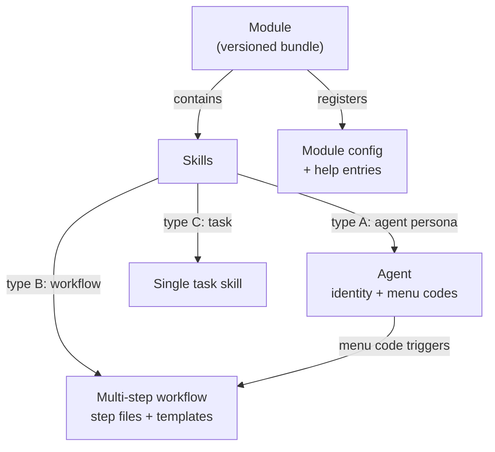

# 1 · What Is BMad Method (and What "v6" Means Here)

> Part of the [BMad Method Report](index.md) for the **Contextual** project.

## 1.1 The framework in one paragraph

**BMad Method** (originally *"Breakthrough Method for Agile AI-Driven Development"*) is an open-source, AI-native development framework from [bmad-code-org](https://github.com/bmad-code-org/BMAD-METHOD). It installs a set of named **skills** into AI coding tools (Claude Code, Antigravity, Kiro, Cursor, Codex, …) so that an AI agent can carry work through an explicit delivery loop — **decide what to build → decide how it holds together → break it into stories → build with review → correct course → learn** — instead of turning unstated assumptions directly into code.

Its design goals, per the official README:

- **Right-sized process** — trivial changes go straight to build; big initiatives get full planning depth.
- **Durable context** — decisions persist as artifacts (briefs, PRDs, specs, architecture) that later skills read, instead of being re-explained per chat.
- **Specialized perspectives** — named agents (product, architecture, UX, dev, research) bring role-specific rigor.
- **One delivery path** — from early ideation through reviewed implementation and retrospection.

## 1.2 The three primitives (v6 model)

BMad v6 has exactly three building blocks. Everything else is composition.

| Primitive | What it is | Examples in this repo |
|---|---|---|
| **Skill** | A named command the installer drops into your AI tool's skills directory. Typing its name (sometimes with `/` or `$` prefix) loads it. A skill either **loads an agent persona**, **runs a multi-step workflow**, or **runs a single task**. | `bmad-prd`, `bmad-build`, `bmad-help` |
| **Agent** | A named persona + menu. Technically just a skill whose body defines an identity; agents expose short **menu codes** scoped to that agent (`CR` = *competitive teardown* for Mary, *code review* for Amelia). | `bmad-agent-pm` (John), `bmad-agent-dev` (Amelia) |
| **Module** | A versioned bundle of skills + config + help entries, installed as a unit. `core` ships with everything; other modules are opt-in. | `bmm`, `bmad-loop`, `dbw` |

## 1.3 Official module ecosystem vs. what's installed here

Official ecosystem modules (from the GitHub README, Sept 2026):

| Module | Purpose | Installed here? |
|---|---|---|
| **BMad Method (BMM)** | Plan and deliver software; the core delivery method | ✅ v6.12.0 |
| **BMad Builder (BMB)** | Build your own skills/workflows/agents | ❌ |
| **BMad Creative Intelligence Suite (CIS)** | Innovation, design thinking, storytelling partners | ❌ |
| **BMad Test Architect (TEA)** | Enterprise testing add-on | ❌ |
| **BMad Loop** | Unattended epic builds, adversarial review, deferred-work sweeps | ✅ v0.11.1 (external repo) |
| **BMad Game Dev Studio (GDS)** | Game ideation/design/build for Unity, Unreal, Godot, Phaser | ❌ |
| **dbw (local/custom)** | *Not an official module* — a local "Diagram-Based Workflow" module, Mermaid/C4-first architecture documentation. `source: unknown` in the manifest. | ⚠️ installed, sources missing (see [08-modules.md §8.4](08-modules.md)) |

## 1.4 Version context: where v6.12.0 sits

- This project pins **core 6.12.0 / bmm 6.12.0**, installed 2026-09-05.
- npm shows `bmad-method@6.12.0` as the latest published version ("last published: 7 days ago" as of 2026-09) — **this install is current**.
- Notable recent upstream shifts visible in the local files:
  - **v6.10.0** introduced `bmad-loop` as an installer module and the `[[workflow.review_layers]]` customization shape (confirmed by the bmad-loop setup guide).
  - **6.10.1** renamed `bmad-dev-auto` → `bmad-build-auto` (this repo has the new name).
  - **v6.12 era** renamed *Quick Dev* → **Build** (`bmad-quick-dev` → `bmad-build`, breaking change in the release notes) and consolidated standalone reviewers into the merged `bmad-review` with lens routing. The local `_bmad/bmm/v6-shims/` folder exists precisely to keep old skill IDs (`bmad-quick-dev`, `bmad-create-prd`, `bmad-market-research`, …) forwarding to the new names until v7.

## 1.5 Runtime prerequisites (official)

- An AI coding tool that supports the **Agent Skills** format (a folder with `SKILL.md`).
- **Node.js ≥ 20.12** for the installer (`npx bmad-method install`).
- **uv** on PATH — BMad runs its Python tooling through `uv run`, which provisions Python 3.11+ automatically. This repo's workflow skills hard-require it (see [05-render-pipeline.md](05-render-pipeline.md)).
- For `bmad-loop`: Python 3.11+, git ≥ 2.34, a terminal multiplexer (tmux), Linux/macOS/WSL.

---

Next: [02-installation-and-version.md](02-installation-and-version.md) — how this install was produced and what the manifests record.
