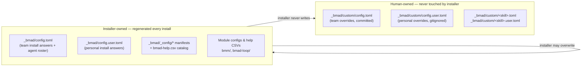

# 2 · Installation & Version Management

> Part of the [BMad Method Report](index.md) for the **Contextual** project.

## 2.1 How this install was created

BMad installs via the npm CLI:

```bash
npx bmad-method install
```

The installer asks which modules to include and which AI tools to target, then writes three things: (a) the runtime under `_bmad/`, (b) one skill directory per skill into each selected tool's skills directory, and (c) a `_config/` manifest recording everything it laid down. It is **idempotent and re-runnable** — prior answers are remembered as defaults, and it regenerates installer-owned files on every run.

### Install timeline for this project (from `_bmad/_config/manifest.yaml`)

| Date (UTC) | Event |
|---|---|
| **2026-08-04 17:56** | Initial install: `core` 6.12.0 + `bmm` 6.12.0 (`source: built-in`) |
| **2026-09-05 10:01** | Added `bmad-loop` v0.11.1 (`source: external`, pinned git SHA `bb7cebe…`) and `dbw` 1.0.0 (`source: unknown`) |
| **2026-09-05 12:47** | Full update/refresh pass — all four modules' `lastUpdated` bumped; bmm config regenerated |

The manifest also records `ides: [antigravity, kiro]` — which is exactly why the skill sets live in `.agent/skills/` (Antigravity) and `.kiro/skills/` (Kiro), and why no `.claude/skills/` exists here.

## 2.2 Installer-owned vs human-owned files

This is the most important ownership rule in BMad v6, stated on the files themselves:



Every installer-generated TOML opens with this warning (verbatim from `_bmad/config.toml`):

> *"Installer-managed. Regenerated on every install — treat as read-only. Direct edits to this file will be overwritten on the next install. To change an install answer durably, re-run the installer… To pin a value regardless of install answers, or to add custom agents / override descriptors, use `_bmad/custom/config.toml` (team, committed) / `_bmad/custom/config.user.toml` (personal, gitignored)."*

This project follows the rule: `custom/` holds only the commented example templates.

## 2.3 The `_bmad/_config/` manifest layer

Three CSV/YAML files form the installation's source of truth:

### `manifest.yaml` — what is installed

```yaml
installation:
  version: 6.12.0
  installDate: 2026-08-04T17:56:16.927Z
  lastUpdated: 2026-09-05T12:47:51.798Z
  installShims: false
modules:
  - name: core        # version 6.12.0, source: built-in
  - name: bmm         # version 6.12.0, source: built-in
  - name: bmad-loop   # version v0.11.1, source: external,
                      #   repoUrl: https://github.com/bmad-code-org/bmad-loop
                      #   channel: stable, sha: bb7cebec4ee4f0fa2783a56ffd0b1b8bc67c4ec5
  - name: dbw         # version 1.0.0, source: unknown, channel: next
ides:
  - antigravity
  - kiro
```

Key observations:

- **External module provenance is pinned by git SHA** — `bmad-loop` v0.11.1 at commit `bb7cebe…`, channel `stable`. Updates re-resolve the channel but the recorded SHA makes the installed state auditable.
- **`installShims: false`** — the v6→v7 deprecation shim *installation flag* is off at the top level; the `bmm/v6-shims/` folder still ships inside the bmm module itself (grouping only, see [04-skill-anatomy.md §4.6](04-skill-anatomy.md)).
- **`source: unknown` for dbw** is the manifest's own signal that this module didn't come from npm, a git repo, or the built-in set — the first clue of its drift (see [08-modules.md](08-modules.md)).

### `skill-manifest.csv` — every skill, canonically

One row per skill: `canonicalId, name, description, module, path` — the `path` pointing at the skill's source-of-truth location under `_bmad/` (e.g. `_bmad/bmm/ship/bmad-build/SKILL.md`). 35 rows: 8 core, 24 bmm (5 agents + 19 workflows… see appendix for the full table), 3 bmad-loop, 3 dbw.

### `files-manifest.csv` — per-file integrity

One row per installed file: `type, name, module, path, hash` (SHA-256). 246 entries covering SKILL.md files, step files, templates, HTML report templates, Python scripts (including their pytest tests and — notably — committed `__pycache__/*.pyc` files), and the scripts themselves. This is what makes an install **verifiable**: any drifted/modified file can be detected by re-hashing.

## 2.4 Version freshness assessment (as of 2026-09-14)

| Component | Installed | Latest known | Status |
|---|---|---|---|
| BMAD core | 6.12.0 | 6.12.0 (npm, published ~2026-09-04) | ✅ current |
| BMM module | 6.12.0 | 6.12.0 | ✅ current |
| bmad-loop | v0.11.1 @ `bb7cebe` | tracks its own repo (channel: stable) | ℹ️ pinned; check repo for newer stable |
| dbw | 1.0.0 | local/unregistered | ⚠️ sources missing from disk |

**Update mechanics** (official): `npx bmad-method install` re-run refreshes in place; `bmad-help` can report module doc URLs (the `_meta` rows in `bmad-help.csv` point at `https://docs.bmad-method.org/`); for `bmad-loop`, `/bmad-loop-setup` handles upgrades (`uv tool upgrade bmad-loop --reinstall`).

## 2.5 What "agent management" means at the version layer

The agent roster is **version-controlled config, not code**. `_bmad/config.toml` contains a `[agents.<id>]` table per agent with `module, team, name, title, icon, description`. Two consequences:

1. **Upgrades can change agent descriptors** (icons, descriptions, personas) — the installer regenerates them. Teams that want stable descriptors pin them in `_bmad/custom/config.toml`.
2. **Agents are data**: adding a fictional/custom agent is a pure config edit (no skill folder required) — see [07-configuration-and-customization.md](07-configuration-and-customization.md).

---

Next: [03-directory-structure.md](03-directory-structure.md) — where everything lives on disk.
