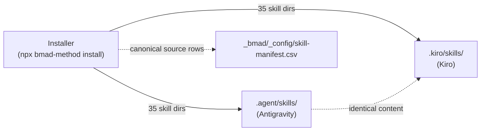

# 3 · Directory Structure & Ownership Map

> Part of the [BMad Method Report](index.md) for the **Contextual** project.

## 3.1 The full tree (verified on disk)

```text
{project-root}/
├── _bmad/                          # BMad runtime — installer-owned scaffolding
│   ├── config.toml                 # installer-managed: team install answers + agent roster
│   ├── config.user.toml            # installer-managed: personal answers (user_name, skill level)
│   ├── config.yaml                 # ⚠ legacy/mirrored YAML view of core config (see 3.4)
│   ├── config.user.yaml            # ⚠ legacy/mirrored YAML (user_name, language)
│   ├── module-help.csv             # ⚠ top-level duplicate of module help rows
│   ├── _config/                    # installation manifests (installer-written)
│   │   ├── manifest.yaml           # versions, dates, module sources, target IDEs
│   │   ├── skill-manifest.csv      # 35 rows: canonicalId,name,description,module,path
│   │   ├── files-manifest.csv      # 246 rows: per-file SHA-256 integrity
│   │   └── bmad-help.csv           # 35 rows: help catalog read by bmad-help
│   ├── bmm/                        # BMM module sources (v6.12.0)
│   │   ├── config.yaml             # module config (paths, skill level)
│   │   ├── module-help.csv         # BMM help entries
│   │   └── v6-shims/               # deprecated skill-ID forwarders (bmad-quick-dev→bmad-build…)
│   ├── bmad-loop/                  # bmad-loop module sources (v0.11.1)
│   │   ├── config.yaml
│   │   └── module-help.csv
│   ├── custom/                     # HUMAN-owned overrides (empty templates here)
│   │   ├── config.toml             # team overrides (committed)
│   │   ├── config.user.toml        # personal overrides (gitignored via .gitignore)
│   │   └── .gitignore              # "*.user.toml"
│   ├── render/                     # rendered immutable skill snapshots (gitignored: "*")
│   │   ├── .gitignore
│   │   ├── bmad-build/contextual-b3c8d07f5cf0/b2c4dcb4ad8e1e76649d/…
│   │   └── bmad-build-auto/contextual-b3c8d07f5cf0/bea75d6809fe070fb744/…
│   └── scripts/                    # runtime Python (uv-run) tooling
│       ├── render_skill.py         # the snapshot renderer (every workflow skill)
│       ├── resolve_config.py       # central 4-layer TOML → JSON resolver
│       ├── resolve_customization.py# per-skill 3-layer TOML → JSON resolver
│       ├── config_utils.py         # strict TOML loading + structural merge engine
│       └── memlog.py               # append-only session memory log (.memlog.md)
│
├── .agent/skills/                  # Antigravity: 35 skill dirs, 245 files (verbatim copies)
├── .kiro/skills/                   # Kiro: 35 skill dirs, 245 files (byte-identical set)
├── .kiro/agents/                   # empty (Kiro native agent files unused)
│
├── _bmad-output/                   # workflow artifacts (created by skills, not installer)
│   ├── planning-artifacts/         # briefs, prds, architecture/, epics.md, tech-stack.md,
│   │   └── ux-designs/ux-Contextual-2026-09-06/
│   └── implementation-artifacts/   # per-story specs (1-1…4-5), sprint-status.yaml,
│                                   # retro docs, bmad-build-auto results
│
├── docs/                           # project knowledge (bmm project_knowledge target)
└── planning-artifacts/             # ⚠ stray duplicate (dbw config pointed here)
```

Note the naming trap: `_bmad-output/` (BMad's artifact folder) vs `planning-artifacts/` at the root (a stray folder left by the `dbw` module's config — see [08-modules.md §8.4](08-modules.md)).

## 3.2 Who owns what (critical for upgrades)

| Layer | Owner | Safe to edit? | Regenerated when? |
|---|---|---|---|
| `_bmad/config.toml` / `config.user.toml` | Installer | ❌ read-only | Every `npx bmad-method install` |
| `_bmad/_config/*` | Installer | ❌ read-only | Every install (rebuilt catalogs) |
| Module sources (`_bmad/bmm/`, `_bmad/bmad-loop/`) | Installer | ❌ read-only | Every install |
| `.agent/skills/*`, `.kiro/skills/*` | Installer | ❌ read-only | Every install |
| `_bmad/scripts/*` | Installer (upstream project) | ❌ read-only | Every install |
| `_bmad/custom/*` | **You / your team** | ✅ yes | Never touched by installer |
| `_bmad/render/*` | The render script | ❌ never edit | Every skill invocation (new generation dirs) |
| `_bmad-output/*` | Skills + you | ✅ yes | Continuously during work |
| `.gitignore` entries | You | ✅ | Manual |

## 3.3 What is committed vs ignored

Verified from git: only **22 files** under `_bmad/` are tracked — the configs, manifests, module config/help CSVs, v6-shims README, custom templates, and the five scripts. Ignored by explicit `.gitignore` rules:

- `_bmad/render/*` (its own `.gitignore` is `*` / `!.gitignore`) — rendered snapshots are **reproducible**, so they're never committed.
- `.agent/` and `.kiro/` skill dirs — **not tracked** (untracked but also not ignored in `.gitignore`; they simply aren't staged — each developer's install generates them per their chosen IDEs).
- `_bmad/custom/*.user.toml` — personal overrides, via `_bmad/custom/.gitignore`.

This yields a clean team story: **the repo carries the small, reviewable config + manifests; each machine materializes skills and renders on demand.**

## 3.4 The YAML/CSV stragglers (minor redundancy)

Three files duplicate information that the TOML/manifest system already owns:

| File | Content | Assessment |
|---|---|---|
| `_bmad/config.yaml` | `document_output_language`, `output_folder`, `project_name`, plus a `dbw:` section | Legacy YAML view; its `dbw:` block is the only remnant of dbw config outside the manifest |
| `_bmad/config.user.yaml` | `user_name`, `communication_language` | Legacy duplicate of `config.user.toml` |
| `_bmad/module-help.csv` (top level) | dbw module rows | Duplicate of rows already in `_bmad/_config/bmad-help.csv` |

The resolver (`config_utils.load_central_config`) reads **only the four TOML files** — the YAML files are not part of the merge chain. They are most plausibly leftovers from an earlier dbw-module setup script (the dbw `module-help.csv` lists `dbw-setup` outputting "config.yaml and config.user.yaml"). Harmless, but they should be removed or regenerated by whoever owns the dbw module (see [09-operations.md](09-operations.md)).

## 3.5 IDE skills directories — the dual install

The manifest's `ides: [antigravity, kiro]` drove the installer to write the identical skill set twice:



- `diff` confirms the two directories contain **identical skill names**; both total 245 files across 35 skills.
- Per official docs, the tool determines the directory: Claude Code → `.claude/skills/`, Antigravity → `.agent/skills/`, "Cursor/Windsurf/Codex/Auggie/Amp and most others" → `.agents/skills/`, Cline → `.cline/skills/`. The directory name equals the skill name, and **the installed directories are the canonical list** of what the AI tool can invoke.
- `.claude/` exists in this repo but holds only `settings.json` (graphify hook-guard hooks) — Claude Code skills are **not** installed; Claude Code here would not see BMad skills unless reinstalled targeting it.

---

Next: [04-skill-anatomy.md](04-skill-anatomy.md) — what's inside a skill and the two invocation styles.
