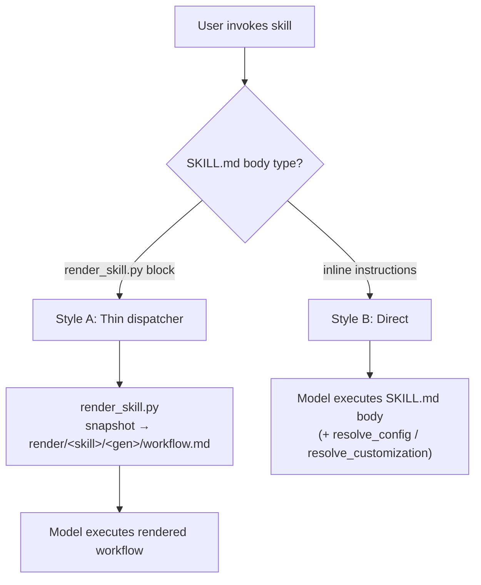
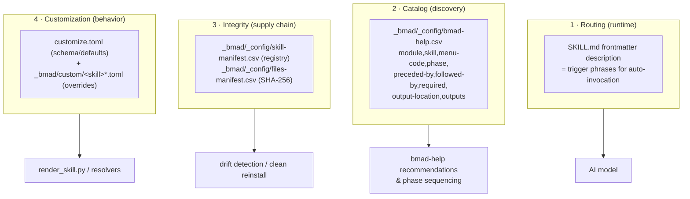

# 4 · Skill Anatomy — How Skills Are Structured & Managed

> Part of the [BMad Method Report](index.md) for the **Contextual** project.

## 4.1 The universal contract: `SKILL.md`

Every skill — agent, workflow, or task — is a directory whose name **is** the skill ID, containing a `SKILL.md` with YAML frontmatter:

```yaml
---
name: bmad-build
description: 'Turns implementation work into working code, reviewed and verified.
  Use when the user delegates a feature, story, bug fix, or meaningful change…'
---
```

The `description` is not documentation — it is the **routing surface**. The AI tool reads all installed skills' descriptions to decide when to auto-invoke a skill; that's why well-written BMad descriptions contain explicit "Use when the user says…" trigger phrases ("run code review", "create a spec", "walk me through this change") and, just as deliberately, *negative* triggers ("Never invoke this uninvoked, including on edits you just made." — `bmad-review`).

## 4.2 Two invocation architectures

Inspecting all 35 installed skills reveals two distinct body styles:

### Style A — Thin dispatcher (rendered skills)

Only **2 skills** use this: `bmad-build` and `bmad-build-auto` — the two heavyweight implementation workflows. Their entire SKILL.md body is:

```bash
uv run --no-cache "{project-root}/_bmad/scripts/render_skill.py" \
  --project-root "{project-root}" --skill "{skill-root}"
```

…plus two hard rules: *on success, read and follow the single absolute `workflow.md` path printed to stdout; on failure (including `uv` missing), report the output and HALT — never run workflow sources directly.*

Why render instead of reading in place?

1. **Immutable, hash-verified snapshot** — the model can't edit its own instructions mid-run; a tampered/corrupted generation fails verification instead of silently misbehaving (see [05-render-pipeline.md](05-render-pipeline.md)).
2. **Config token resolution** — `{{config.*}}` and `{workflow.*}` placeholders are substituted with resolved values so the executed instructions are fully concrete.
3. **Fresh customization** — each invocation merges current team/user overrides without touching installed files.

### Style B — Direct skills (the other 33)

The SKILL.md body *is* the instructions: persona definitions for agents, step-by-step procedures for workflows, and helper-file references. They still read central config at runtime (usually via `resolve_config.py` / `resolve_customization.py`) but execute in place.



## 4.3 Workflow skill internal layout

Multi-step workflows organize supporting material in conventional subfolders. `bmad-build` (verified):

```text
.agent/skills/bmad-build/
├── SKILL.md                  # thin dispatcher (Style A)
├── customize.toml            # customization schema (defaults; DO NOT EDIT)
├── workflow.md               # main entry: router + activation sequence
├── step-01-clarify-and-route.md
├── step-02-plan.md
├── step-03-implement.md
├── step-04-review.md
├── step-05-present.md
├── step-oneshot.md           # small-change fast path
├── compile-epic-context.md
├── spec-template.md
├── sync-sprint-status.md
├── references/
│   ├── claims-check.md       # anti-hallucination evidence check
│   └── deletion-check.md
└── review-prompts/
    ├── edge-case-hunter.md   # self-contained reviewer prompts
    └── verification-gap.md
```

Naming conventions across the whole install:

| Convention | Meaning | Examples |
|---|---|---|
| `workflow.md` | Entry point the renderer outputs; the only file the model is told to follow | all rendered skills |
| `step-NN-*.md` | Ordered procedure steps | bmad-build, bmad-code-review, bmad-walkthrough, bmad-create-epics-and-stories |
| `references/` | Deep-dive reference material loaded on demand | acceptance-verdict, evidence-gathering, headless, validate |
| `assets/` | Templates & static content | prd-template, spec-template, spine-template, validation-report-template.html |
| `scripts/` | Deterministic Python helpers (+ pytest tests) | sprint_plan.py, lint_spine.py, git_evidence.py |
| `review-prompts/` | Complete prompts for context-free reviewer subagents | edge-case-hunter, verification-gap |
| `agents/` | Sub-personas used inside a workflow | web-researcher, artifact-analyzer (bmad-prfaq) |
| `customize.toml` | Customization schema + defaults | all customizable skills |

## 4.4 Agent skills

The five agents are structurally simple: `SKILL.md` with identity + behavioral rules + menu, and a `customize.toml` exposing `[agent]` fields (role, identity, communication_style, principles, icon, menu, persistent_facts, activation hooks). Example (verified, `bmad-agent-dev`):

```yaml
---
name: bmad-agent-dev
description: Senior software engineer who implements stories and code changes.
  Use when the user asks to talk to Amelia or requests the developer agent
---
# Amelia — Senior Software Engineer
```

Full agent treatment in [06-agent-management.md](06-agent-management.md).

## 4.5 How skills are *managed* — the four control planes



- **bmad-help.csv** is the navigation brain: each row carries `phase` (2-planning / plan / ship / anytime), `preceded-by` / `followed-by` sequencing, `required` gates, expected `output-location` and `outputs` — letting `bmad-help` detect which artifacts already exist and recommend the next step (its SKILL.md documents the fuzzy-matching completion-detection algorithm).
- **files-manifest.csv** hashes every installed file, so a suspect install can be audited without network access.
- **customize.toml** doubles as documentation: every customizable field is declared there with comments, and overrides never edit it.

## 4.6 The v6-shims folder

`_bmad/bmm/v6-shims/` holds deprecated skill IDs kept as forwarders so older enterprise muscle-memory still works:

| Shim | Forwards to |
|---|---|
| `bmad-quick-dev` | `bmad-build` |
| `bmad-dev-auto` | `bmad-build-auto` |
| `bmad-create-prd` / `bmad-edit-prd` / `bmad-validate-prd` | `bmad-prd` (create/update/validate intent) |
| `bmad-create-architecture` | `bmad-architecture` |
| `bmad-market-research` / `bmad-domain-research` / `bmad-technical-research` | `bmad-deep-recon` (typed) |
| `bmad-sprint-status` | `bmad-sprint-planning` (status view) |
| `bmad-checkpoint-preview` | `bmad-walkthrough` |
| `bmad-create-story`, `bmad-dev-story` | retained in full |

Removal rides the **v7** cut ("never a 6.x minor"). The folder is grouping-only: the installer discovers skills recursively and installs each under its own `name`, so nesting doesn't affect installed paths. Note: `installShims: false` in this project's manifest, and none of the shim skill dirs appear in `.agent/skills/` — only the current names are installed.

## 4.7 The skills this project has installed (grouped)

| Group | Skills |
|---|---|
| **Core utilities (8)** | bmad-help, bmad-brainstorming, bmad-party-mode, bmad-customize, bmad-advanced-elicitation, bmad-review, bmad-forge-idea, bmad-deep-recon |
| **Agents (5)** | bmad-agent-analyst (Mary), bmad-agent-pm (John), bmad-agent-ux-designer (Sally), bmad-agent-architect (Winston), bmad-agent-dev (Amelia) |
| **Plan workflows (8)** | bmad-product-brief, bmad-prfaq, bmad-prd, bmad-ux, bmad-architecture, bmad-create-epics-and-stories, bmad-sprint-planning, bmad-spec |
| **Ship workflows (7)** | bmad-build, bmad-build-auto, bmad-code-review, bmad-walkthrough, bmad-correct-course, bmad-qa-generate-e2e-tests, bmad-retrospective |
| **Cross-cutting (1)** | bmad-project-context (AGENTS.md management) |
| **bmad-loop (3)** | bmad-loop-setup, bmad-loop-sweep, bmad-loop-resolve |
| **dbw (3, ⚠ orphaned)** | dbw-setup, dbw-documentation, dbw-planning-workflow |

(Full per-skill table with descriptions: [10-appendix.md](10-appendix.md).)

---

Next: [05-render-pipeline.md](05-render-pipeline.md) — the immutable snapshot machinery under `bmad-build`.
