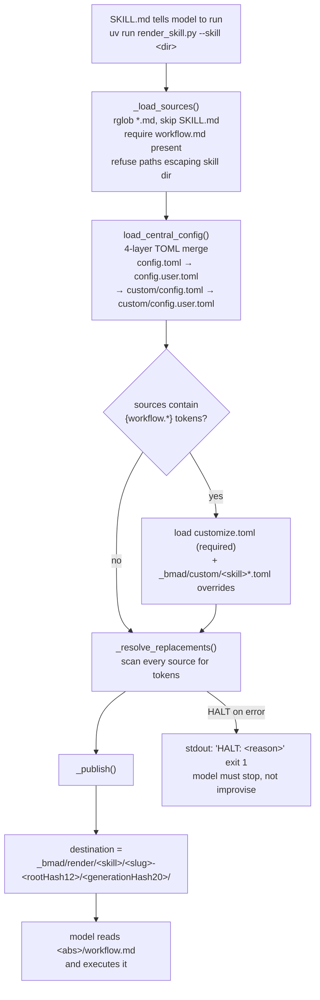
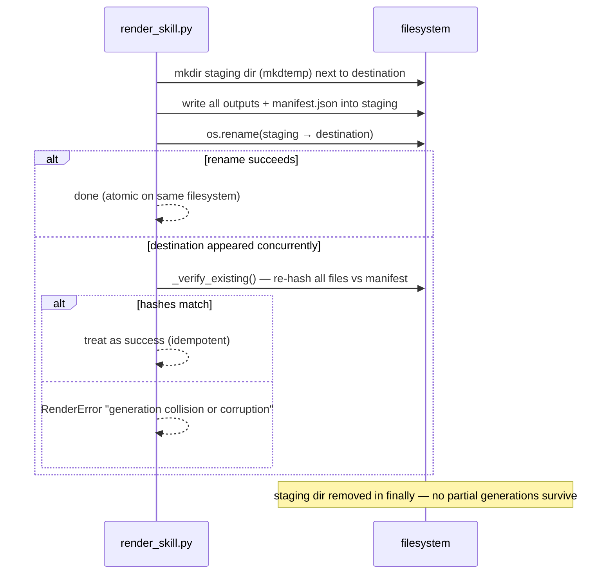

# 5 · The Render Pipeline — Immutable Workflow Snapshots

> Part of the [BMad Method Report](index.md) for the **Contextual** project.

The single most distinctive piece of engineering in this install is `render_skill.py` (419 lines, Python 3.11+, stdlib-only, run via `uv run --no-cache`). It converts a skill's Markdown sources + live config into a **content-addressed, hash-verified, immutable snapshot** each time a rendered skill is invoked.

## 5.1 End-to-end flow



## 5.2 The three token languages

Sources may embed three kinds of placeholders, resolved before publication:

| Token | Resolves from | Notes |
|---|---|---|
| `{{config.<dotted.path>}}` | Central config (4-layer merge) | e.g. `{{config.modules.bmm.implementation_artifacts}}`; `{project-root}` inside values is expanded and must yield an absolute path |
| `{{.<shortkey>}}` | Central config, by leaf key | Convenience form; **errors if the key is ambiguous** — if two keys share a leaf name, rendering HALTs rather than guessing |
| `{workflow.<field>}` | Per-skill customization merge | String/list/table values rendered as Markdown; `[[workflow.review_layers]]` arrays render as titled sections; a layer with empty `instruction` is dropped — if **no** active layers remain, render HALTs with `no active review layers` (a deliberate safety stop, mirrored by `bmad-loop validate`'s `skills.review-layers-empty` check) |
| `[[bmad-snapshot:<file.md>]]` | Local path into the rendered generation | Lets prose point at sibling files by their immutable absolute path |

`{skill-root}` references inside customization prose are rewritten to the **destination** path — so a reviewer layer that reads `{skill-root}/review-prompts/edge-case-hunter.md` reads the *rendered generation's copy*, not the mutable installed one.

## 5.3 Content addressing: how generations are identified

The destination directory is derived, never chosen:

```text
_bmad/render/<skill-name>/<project-slug>-<root-hash-12>/<generation-hash-20>/
```

- `root-hash-12` = first 12 hex chars of `sha256(project_root_path)`
- `generation-hash-20` = first 20 hex chars of `sha256(canonical-json(identity))` where identity = `{ project_root, renderer_sha256, resolved_values, source_sha256 }`

Consequences:

- **Same inputs → same generation directory.** Re-running a skill with unchanged config, customization, sources, and renderer verifies the existing snapshot instead of duplicating it (`_verify_existing` re-hashes every output file against the manifest and refuses mismatches: *"generation collision or corruption"*).
- **Any change → new generation.** Editing `_bmad/custom/bmad-build.toml` or a review layer produces a different hash and a new directory, while the old generation remains intact for auditability.
- The **rendered outputs differ from sources only where tokens existed** — visible in the manifest: e.g. `step-01-clarify-and-route.md` source hash ≠ output hash (tokens substituted) while `references/claims-check.md` hashes are identical (no tokens).

## 5.4 The generation manifest

Each generation writes `manifest.json` (schema_version 1) recording the full derivation — verified from this project's `bmad-build` generation `b2c4dcb4ad8e1e76649d`:

```json
{
  "schema_version": 1,
  "skill": "bmad-build",
  "project_root": "/Users/prajwal/Documents/learning/Contextual",
  "project_slug": "contextual",
  "root_hash": "b3c8d07f5cf0",
  "generation_hash": "b2c4dcb4ad8e1e76649d",
  "inputs": {
    "renderer_sha256": "8496d0d8…",
    "resolved_values": {
      "config.core.communication_language": "English",
      "config.modules.bmm.implementation_artifacts": "…/_bmad-output/implementation-artifacts",
      "customization.workflow.review_layers": [ "… blind-hunter, edge-case-hunter, verification-gap …" ]
    },
    "source_sha256": { "workflow.md": "481ff00e…", "step-01-clarify-and-route.md": "1e8095b0…" }
  },
  "outputs": { "workflow.md": "50aa7235…", "step-01-clarify-and-route.md": "e0df30c3…" }
}
```

This is a **supply-chain audit trail**: any rendered instruction the model executed can be traced to exact input sources, resolved config values, and the renderer binary hash that produced it.

## 5.5 Atomic publication

Publication is crash-safe by construction:



## 5.6 The supporting resolver scripts

| Script | Role |
|---|---|
| `resolve_config.py` | CLI for the central 4-layer merge; `--key modules.bmm.planning_artifacts` style lookups; JSON to stdout (UTF-8 forced — Windows cp1252 can't encode agent emoji icons) |
| `resolve_customization.py` | CLI for the per-skill 3-layer merge; careful project-root inference (cwd → script's own install path → skill dir) with an explicit stderr warning if a chosen root lacks overrides another candidate has; `_bmad/` outranks `.git` when walking up (nested repos/submodules) |
| `config_utils.py` | The merge engine: strict `tomllib` loading; **structural merge** = tables deep-merge, arrays of tables with consistent `id`/`code` merge by key, all other arrays append |
| `memlog.py` | Append-only `.memlog.md` session memory (frontmatter + one-line typed entries like `- (decision) …`), atomic writes, no edit/delete by design — used by long conversational skills to persist state across sessions |

Two design choices worth noting in `config_utils.py`: keyed merge detection is **all-or-nothing** (mixing `code`-keyed and `id`-keyed items falls back to append, per official docs), and there is **no removal operation** — overrides can replace or add, never delete base items. To suppress a default behavior you override it with a no-op, which is exactly how the docs recommend disabling a menu item.

---

Next: [06-agent-management.md](06-agent-management.md) — the five agents and how they're managed.
