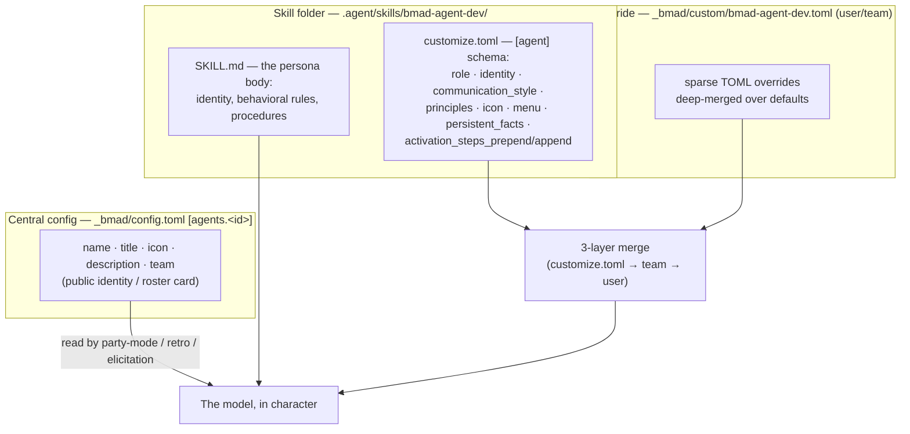
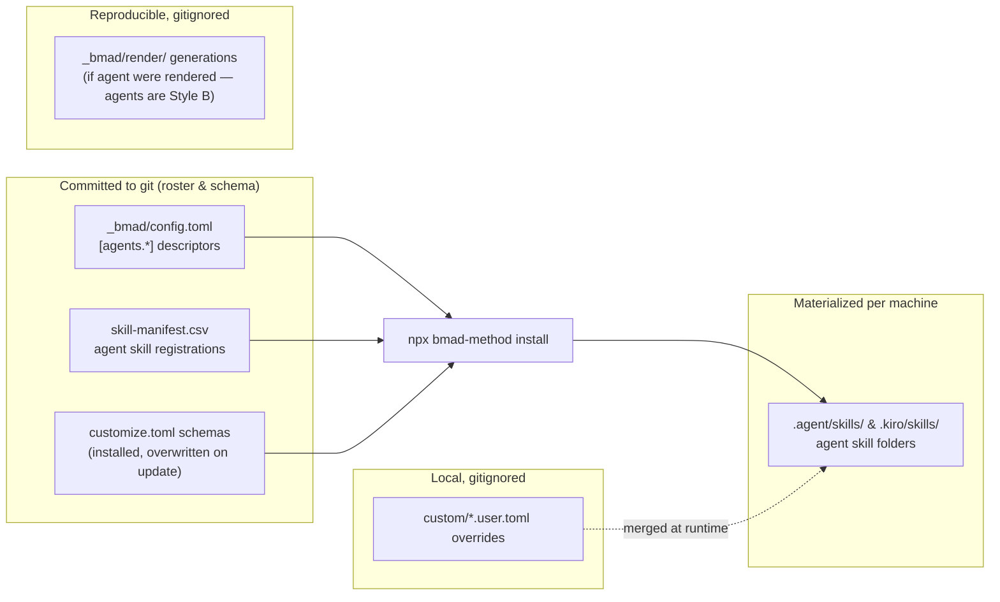

# 6 · Agent Management

> Part of the [BMad Method Report](index.md) for the **Contextual** project.

## 6.1 The roster

Five named agents ship with the BMM module. Their descriptors live in `_bmad/config.toml` under `[agents.<skill-id>]` — this is the "roster" that roster-aware skills (party mode, retrospective, elicitation) read. Descriptors verified from this install:

| Skill ID | Name | Title | Icon | Team | Persona flavor (from descriptor) |
|---|---|---|---|---|---|
| `bmad-agent-analyst` | Mary | Business Analyst | 📊 | software-development | Porter's strategic rigor + Minto's Pyramid Principle; evidence-grounded; "treasure hunter narrating the find" |
| `bmad-agent-pm` | John | Product Manager | 📋 | software-development | Jobs-to-be-Done over template filling; "detective interrogating a cold case" |
| `bmad-agent-ux-designer` | Sally | UX Designer | 🎨 | software-development | Empathy with edge-case rigor; "filmmaker pitching the scene before the code exists" |
| `bmad-agent-architect` | Winston | System Architect | 🏗️ | software-development | Boring technology for stability; "seasoned engineer at the whiteboard… trade-offs rather than verdicts" |
| `bmad-agent-dev` | Amelia | Senior Software Engineer | 💻 | software-development | Test-first (red/green/refactor); "terminal prompt: exact file paths, AC IDs, commit-message brevity" |

Official docs vs this install: the agent set and names match the official five exactly (the docs note *Paige, the Technical Writer, is on hiatus* — her replacement skill, `bmad-project-context`, is installed). Each descriptor's `team` field ("software-development") exists for filtering in multi-agent features.

## 6.2 How an agent is "made"

An agent is **two layers of data plus one skill**:



The split is deliberate: **rewriting Amelia's principles is per-skill** (how she behaves when activated); **changing the one-line description party mode uses to introduce her is central config** (how the roster presents her).

## 6.3 Activation: skills vs menu codes

Official docs (matched by this install's help catalog):

| Mechanism | Invocation | Behavior |
|---|---|---|
| **Skill** | Type `bmad-build …` | Loads that skill directly |
| **Agent menu trigger** | Load `bmad-agent-dev` (say "Amelia…"), then type a code like `BD` | Amelia stays in character and starts the matching workflow |

Menu codes are **scoped per agent** — `CR` means *competitive teardown* to Mary but *code review* to Amelia. This install's codes (from `skill-manifest.csv` descriptions + official table):

| Agent | Codes |
|---|---|
| Mary (Analyst) | BP, MR, DR, TR, TS, CR, UV, CB, WB, PC |
| John (PM) | PRD, CE, IR, CC |
| Winston (Architect) | CA, IR |
| Amelia (Dev) | BD, QA, CR, SP, ER |
| Sally (UX) | CU |

`bmad-help` can map any of these back to the underlying skill via `bmad-help.csv` (`menu-code` column), which is also how agent activation steps locate workflows.

## 6.4 The customization surface for agents

From the official *Customize BMad* model, matching this install's `customize.toml` files:

- **Scalars** (`icon`, `role`, `identity`, `communication_style`) — override wins.
- **Arrays** (`persistent_facts`, `principles`, `activation_steps_prepend`, `activation_steps_append`) — append (team items, then user items).
  - `persistent_facts` entries are literal sentences or `file:{project-root}/…` references (globs allowed) loaded as standing context.
- **Menu** (`[[agent.menu]]`) — array of tables keyed by `code`; matching code replaces, new code appends; each item carries exactly one of `skill` or `prompt`.
- **Read-only metadata**: `agent.name` and `agent.title` are ignored at runtime — rebranding the persona means copying the skill folder; renaming the roster card is a central-config edit.

Activation order for a customizable agent: resolve `[agent]` block → run `activation_steps_prepend` → load `persistent_facts` → resolve config/variables → greet → run `activation_steps_append` → hand control to the persona body.

## 6.5 Current customization state in this project

**None.** `_bmad/custom/` contains only the shipped template comments (verified) — the team and personal override files for agents are absent. Concretely: every agent on this machine runs **exactly the shipped v6.12.0 persona**. The escape hatches are ready but unused:

```text
_bmad/custom/bmad-agent-<role>.toml        # team overrides (would be committed)
_bmad/custom/bmad-agent-<role>.user.toml   # personal overrides (gitignored)
```

`bmad-customize` exists precisely to author these from plain-language requests, writing sparse files and verifying the merge.

## 6.6 Multi-agent orchestration

Two installed skills operate on the roster:

- **`bmad-party-mode`** — orchestrates in-character group discussions between installed agents or custom personas; supports saved parties. It reads the central `[agents.*]` descriptors for introductions, and the docs' example shows adding a *fictional* agent purely through a `[agents.kirk]` config block — no skill folder needed (the descriptor alone makes it invitable; `team` fields filter who gets invited).
- **`bmad-retrospective`** — runs an epic retro with sourced evidence (it ships `scripts/git_evidence.py` and `scripts/sprint_status.py` — with pytest tests — for pulling evidence from git and the sprint tracking file) and can frame discussions as agent perspectives.

## 6.7 Agents as versioned artifacts — the management summary



In short: **agent management in BMad v6 is config management.** Identities are committed TOML, behaviors are committed schema + optional committed overrides, and nothing about an agent requires code changes — which is what makes the five personas auditable, diffable, and portable across the team.

---

Next: [07-configuration-and-customization.md](07-configuration-and-customization.md) — the full merge system.
