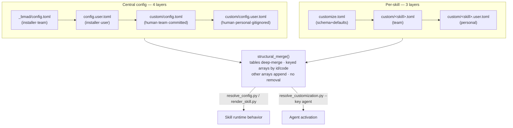

# 7 · Configuration & Customization System

> Part of the [BMad Method Report](index.md) for the **Contextual** project.

BMad v6 has **two independent TOML systems** that share one merge engine (`config_utils.py`) and one philosophy: *installed files are never edited; overrides live beside them and win by layer.*

## 7.1 System 1 — Central configuration (install answers + roster)

Four files, merged in this order (lowest → highest priority):

| Priority | File | Scope | Owner |
|---|---|---|---|
| 4 (base) | `_bmad/config.toml` | team install answers + `[agents.*]` roster | installer |
| 3 | `_bmad/config.user.toml` | personal install answers (`user_name`, skill level) | installer |
| 2 | `_bmad/custom/config.toml` | team overrides — **committed** | humans |
| 1 (wins) | `_bmad/custom/config.user.toml` | personal overrides — **gitignored** | humans |

What's actually in them here (verified):

- `config.toml` — `[core]` project name/language/output folder; `[modules.bmm]` the three artifact paths; five `[agents.*]` tables.
- `config.user.toml` — `[core] user_name/communication_language`; `[modules.bmm] user_skill_level = "intermediate"`.
- `custom/config.toml` & `custom/config.user.toml` — **commented templates only** (no overrides authored).

Resolve it any time:

```bash
uv run _bmad/scripts/resolve_config.py --project-root .            # full dump
uv run _bmad/scripts/resolve_config.py -p . -k core.communication_language -k modules.bmm.planning_artifacts
```

## 7.2 System 2 — Per-skill customization

Every customizable skill ships a `customize.toml` — simultaneously the **schema**, the **defaults**, and the **documentation** ("DO NOT EDIT — overwritten on every update"). Overrides live in `_bmad/custom/` named after the skill directory:

| Priority | File | Committed? |
|---|---|---|
| 3 (base) | `<skill-dir>/customize.toml` | installed (never commit edits) |
| 2 | `_bmad/custom/<skill>.toml` | ✅ team |
| 1 (wins) | `_bmad/custom/<skill>.user.toml` | ❌ personal (gitignored via `custom/.gitignore` → `*.user.toml`) |

### What a workflow's surface looks like (from `bmad-build/customize.toml`, verified)

| Field | Type | Purpose |
|---|---|---|
| `activation_steps_prepend` / `_append` | string[] | hooks around the greeting (prepend = before greeting, append = after) |
| `persistent_facts` | string[] | standing context; literal text, `file:` refs (globs), or `skill:` refs |
| `on_complete` | string | post-completion instruction |
| `open_spec` | string | optional "open finished spec in editor" recipe (docs show editor-specific examples) |
| `implementation_handoff` | string | the entire step-03 execution recipe — default launches a context-free subagent pointed at the spec; overridable to drive an external tool instead |
| `[[workflow.review_layers]]` | array of tables | the review step: each layer has `id`, `name`, `instruction` (the full reviewer recipe), optional `when` gate; empty `instruction` disables |
| `[[workflow.oneshot_review_layers]]` | array of tables | same idea for the small-change fast path |

`bmad-code-review` ships a fourth review layer (`acceptance-auditor`, gated `when = 'Only when {review_mode} = "full".'`) — a nice illustration that layers are per-skill, not global.

### Merge rules — shape-based, not name-based

The resolver never special-cases field names; behavior follows the value's shape (verified in `config_utils.py`, matching official docs):

| Shape | Rule |
|---|---|
| Scalar (string/int/bool/float) | **Override wins** |
| Table | **Deep merge** recursively |
| Array of tables, every item keyed by `code` (or all by `id`) | **Merge by key** — matching key replaces in place, new keys append |
| Any other array | **Append** — base, then team, then user |
| (No shape removes items) | Removal is impossible by design; suppress via no-op override |

> ⚠️ The official docs' strongest warning: **never copy the whole `customize.toml` into an override.** Sparse overrides inherit everything omitted; a full copy freezes today's defaults and silently shadows new values shipped by updates.

### One-run overrides

A single invocation can be customized without persistent files by adding `--set key=value` / `--overrides file.toml` to the `render_skill.py` command in the SKILL.md — layering on top of the persistent files, `--set` winning.

## 7.3 The whole picture



## 7.4 Verification & inspection commands

```bash
# What will the merged central config say?
uv run _bmad/scripts/resolve_config.py --project-root "$PWD"

# What will bmad-build use for its review layers?
uv run _bmad/scripts/resolve_customization.py \
  --skill "$PWD/.agent/skills/bmad-build" \
  --project-root "$PWD" \
  --key workflow.review_layers

# Which skills have overrides?
ls _bmad/custom/*.toml 2>/dev/null | grep -v config
```

If `uv` is unavailable, agents fall back to reading the TOML files themselves and applying the same rules — but many workflow overrides only apply through the renderer, so keeping `uv` working is the docs' explicit recommendation.

## 7.5 How this project scores against best practice

| Practice (official) | This project |
|---|---|
| Never edit installer-owned files | ✅ clean |
| Overrides only in `_bmad/custom/` | ✅ (none authored yet — templates intact) |
| Sparse overrides, never full copies | ✅ vacuously (no overrides) |
| Keep `uv` available | ✅ (render generations exist, so it works) |
| Commit team overrides, ignore user overrides | ✅ (`custom/.gitignore` = `*.user.toml`) |
| Treat installed skill dirs as canonical inventory | ✅ (matches manifest's 35 skills) |

The customization system is configured correctly but **unexercised** — the main lever this project hasn't pulled yet (e.g., pinning org rules as `persistent_facts`, tuning `review_layers`).

---

Next: [08-modules.md](08-modules.md) — module deep-dives, including the `dbw` drift case.
