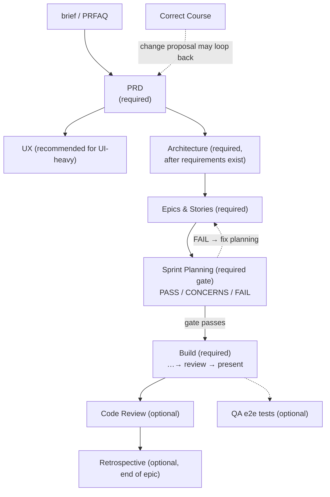
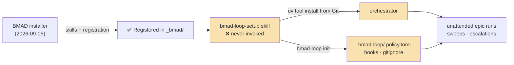

# 8 · Modules Deep-Dive

> Part of the [BMad Method Report](index.md) for the **Contextual** project.

## 8.1 `core` v6.12.0 — the always-there utility belt

Eight skills, module-agnostic, per official docs and the local catalog:

| Skill | Role |
|---|---|
| `bmad-help` | State analysis → next-step recommendations; reads `bmad-help.csv`, fuzzy-matches existing artifacts, offers to run the next skill |
| `bmad-brainstorming` | Facilitated ideation toward 100+ ideas, shifting creative domains to avoid clustering |
| `bmad-party-mode` | Multi-agent roundtables; reads the `[agents.*]` roster; supports saved parties |
| `bmad-customize` | Plain-language authoring of `_bmad/custom/<skill>*.toml` overrides + merge verification |
| `bmad-advanced-elicitation` | Named-method second pass (pre-mortem, first-principles, red-team, socratic…) on recent output |
| `bmad-review` | Lens-based artifact review (adversarial, edge-case, verification-gap, structure, prose); findings in one shape; "never invoke uninvited" |
| `bmad-forge-idea` | Pressure-test a half-formed idea via persona questioning until actionable or dropped |
| `bmad-deep-recon` | Research for decisions: draft a prompt for another tool, process a returned report, or run parallel web research (market/domain/technical/competitive/user-voice/academic-lit) |

## 8.2 `bmm` v6.12.0 — the delivery method (5 agents + 20 workflow skills)

BMM is the reason this project exists. Its skills map to a two-phase lifecycle, and **this repo has already run it across four epics** — `_bmad-output/` is the evidence.

### PLAN phase → `_bmad-output/planning-artifacts/`

| Skill | Produces | Present in this repo |
|---|---|---|
| `bmad-product-brief` | product brief | ✅ `briefs/` |
| `bmad-prfaq` | PRFAQ (Working Backwards) | — |
| `bmad-prd` | PRD (+ HTML validation report) | ✅ `prds/` |
| `bmad-ux` | DESIGN.md + EXPERIENCE.md, UX design folder | ✅ `ux-designs/ux-Contextual-2026-09-06/` (with full UI kit HTML) |
| `bmad-architecture` | architecture spine (+ `lint_spine.py` checker) | ✅ `architecture/` |
| `bmad-spec` | SPEC.md bundles | — |
| `bmad-create-epics-and-stories` | epics.md + stories | ✅ `epics.md`, `tech-stack.md` |
| `bmad-sprint-planning` | readiness gate + `sprint-status.yaml` | ✅ |
| `bmad-project-context` | managed `AGENTS.md` block | repo has `CLAUDE.md` managed block |

### SHIP phase → `_bmad-output/implementation-artifacts/`

| Skill | Produces | Present in this repo |
|---|---|---|
| `bmad-build` | per-story implementation (spec → implement → review → present) | ✅ 20+ story files `1-1`…`4-5` |
| `bmad-build-auto` | one unattended loop iteration | ✅ 3 `bmad-build-auto-result-epic-*` files |
| `bmad-code-review` | multi-reviewer findings + triage | (runs within build flow) |
| `bmad-walkthrough` | guided human review trail | — |
| `bmad-correct-course` | sprint change proposal | — |
| `bmad-qa-generate-e2e-tests` | automated API/e2e suites | — |
| `bmad-retrospective` | evidence-sourced retro + acceptance verdict | ✅ epic-2 & epic-4 retros |

### The BMM flow with required gates

`required=true` rows (`bmad-help.csv`): PRD, Architecture, Epics & Stories, Sprint Planning, Build — everything else is optional depth. `bmad-help` uses exactly these flags plus artifact detection to tell you what's genuinely next.

## 8.3 `bmad-loop` v0.11.1 — unattended epic orchestration (registered, not initialized)

**What it is** (from its upstream setup guide): a module of two halves —

1. **Three skills**: `bmad-loop-setup` (installs/updates the orchestrator tool + registers hooks + writes policy), `bmad-loop-sweep` (read-only triage of the deferred-work ledger → machine-readable partition: bundles / already-resolved / blocked / skip / human-decisions; also migrates legacy ledger formats), `bmad-loop-resolve` (interactive escalation-resolution when a run pauses on a CRITICAL contradiction).
2. **The orchestrator tool** — a separate Python program (`pip`/`uv tool` from `github.com/bmad-code-org/bmad-loop`) that spawns fresh coding-CLI sessions driving `bmad-build-auto`, watches hook signals, verifies artifacts, and manages git-worktree isolation. The BMAD installer **cannot** carry this tool (it copies skill directories only) — the setup skill installs it from Git.

**Status in this project:** the module is **registered but dormant**:

| Expectation | Reality |
|---|---|
| `.bmad-loop/` project dir (policy.toml, ledger) | ❌ absent — `bmad-loop init` never ran |
| Orchestrator installed | ❌ no evidence (`bmad-loop-setup` skill present but unused) |
| Skills installed | ✅ 3 skill dirs in both IDE targets |
| Module registered | ✅ manifest + config + help CSV (installer did its part) |

Consequence: `bmad-loop-sweep` and `bmad-loop-resolve` will not do anything useful until `/bmad-loop-setup` runs `bmad-loop init`. Notably, `bmad-build-auto` results for epics 2–4 *do* exist — produced interactively (invoking the skill directly), not through the orchestrator.

## 8.4 The `dbw` module — drift case

`dbw` ("Diagram-Based Workflow", v1.0.0, `source: unknown`, `channel: next`) is **not an official BMAD module** — it's a locally-authored module providing Mermaid/C4-first architecture documentation (`dbw-documentation`: Document System `[DS]`, Verify Diagram Sync `[VS]`) and visual planning (`dbw-planning-workflow`: Plan Change `[PW]`, Promote Diagrams `[PD]`).

### The forensic picture

| Item | State | Evidence |
|---|---|---|
| Registration in `manifest.yaml` | ✅ present | `name: dbw, version 1.0.0, source: unknown, channel: next` |
| Agent/help catalog rows | ✅ present | `bmad-help.csv` + top-level `module-help.csv` carry 5 dbw rows |
| Legacy config remnant | ⚠️ present | `_bmad/config.yaml` contains a `dbw:` block (docs folder, ADR folder, diagram index) |
| **Skill sources under `_bmad/dbw/`** | ❌ **missing** | `files-manifest.csv` references `dbw/module-help.csv` + `dbw/config.yaml` with hashes; **neither file exists on disk** |
| Installed skills (`.agent/skills/`, `.kiro/skills/`) | ⚠️ orphaned | `dbw-setup`, `dbw-documentation`, `dbw-planning-workflow` all present and loadable — but their canonical source paths in `skill-manifest.csv` point at nothing |

### What likely happened

The `files-manifest.csv` (written by the last installer run on 2026-09-05) still tracks dbw files with hashes, and the straggler YAML files (`config.yaml`, `config.user.yaml`, top-level `module-help.csv`) match dbw-setup's declared outputs. The most consistent explanation: **the dbw module was removed from the module source set after installation** (deleted from disk, or its provider dropped it from the installer's inputs), while a later install run rewrote the central config/manifests without pruning the skill registrations and installed skill dirs — or the dbw source tree was removed manually between runs. Either way, the install is in the exact state the official troubleshooting section names: *"Skills from a removed module still appear. The installer does not delete old skill directories."*

### Why it matters

1. `bmad-help` still recommends dbw skills from the catalog → dead-end recommendations.
2. The dbw skills load and will instruct the model to read `_bmad/dbw/...` assets that don't exist (their SKILL.md files are self-contained, so they mostly *work*, but asset references can fail).
3. `skill-manifest.csv` — the supposed canonical registry — lies about what exists under `_bmad/`.

### Remediation options

- **Keep dbw** → restore the `_bmad/dbw/` source tree (or reinstall from wherever the module came from) and re-run the installer to rebuild integrity.
- **Drop dbw** → delete the three `dbw-*` dirs from `.agent/skills/` and `.kiro/skills/`, remove the dbw rows from `bmad-help.csv` / `skill-manifest.csv`, and remove the `dbw:` block from `_bmad/config.yaml` + top-level `module-help.csv` — or simply delete the whole skills dirs and re-run `npx bmad-method install` for a clean set (official recommendation).

Both paths are scripted in [09-operations.md §9.4.2](09-operations.md).

---

Next: [09-operations.md](09-operations.md) — runbook, findings, and recommendations.
