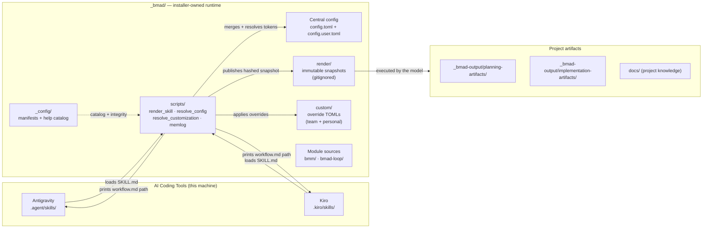
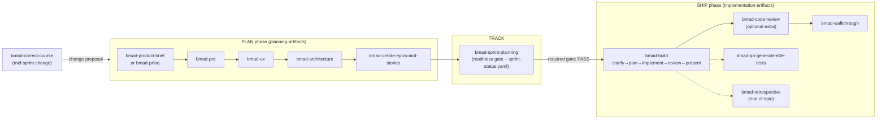
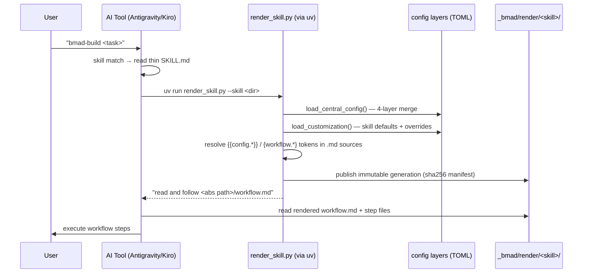
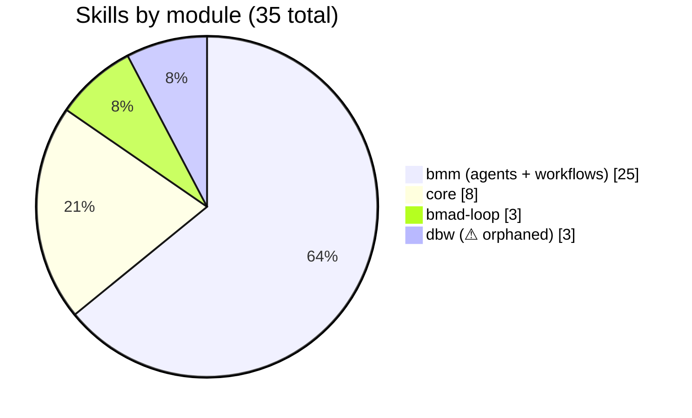

# BMad Method in This Project — Version & Agent Management Report

> **Project:** Contextual · **Report root:** `bmad-method-version-report/` · **Generated:** 2026-09-14
> **Scope:** Full audit of how the BMad Method (BMAD) framework is installed, versioned, configured, customized, and how its agents and skills are managed in this repository.

---

## Executive Summary

| Aspect | Finding |
|---|---|
| **Installed core version** | BMAD core & BMM module **v6.12.0** (matches current npm `bmad-method@6.12.0` — up to date) |
| **Installer** | `npx bmad-method install` (npm CLI). Last run: **2026-09-05T12:47:51Z** |
| **Installed on** | 2026-08-04 (core + bmm), bmad-loop and dbw added 2026-09-05 |
| **Modules** | 4 registered: `core` (6.12.0), `bmm` (6.12.0), `bmad-loop` (v0.11.1 external), `dbw` (1.0.0 local) |
| **Skills installed** | **35 skills** × 2 IDE targets (`.agent/skills/`, `.kiro/skills/`), 245 files per target, byte-identical sets |
| **Agents** | 5 named BMM agents (Mary/John/Sally/Winston/Amelia) declared in `_bmad/config.toml` as agent skills |
| **Invocation model** | Two-tier: thin `SKILL.md` dispatchers → `render_skill.py` → immutable rendered snapshot in `_bmad/render/` |
| **Customization** | 4-layer central TOML merge (`config.toml` → `config.user.toml` → `custom/config.toml` → `custom/config.user.toml`); per-skill 3-layer merge via `customize.toml` + `_bmad/custom/<skill>*.toml` |
| **State of customization** | **Virgin install** — `_bmad/custom/` contains only commented templates; no overrides exist yet |
| **Automation** | `bmad-loop` orchestrator module registered (v0.11.1, pinned git SHA) but **orchestrator tool not initialized** (no `.bmad-loop/` directory) |
| **Known drift** | ⚠️ `dbw` module: skills installed & registered, but source tree `_bmad/dbw/` and its config/module-help files are **missing from disk** |
| **Runtime dependency** | `uv` (Python 3.11+ provisioner) required by the render pipeline at every workflow-skill invocation |

**Health verdict:** The installation follows the official v6 architecture faithfully — manifest-tracked, immutable render pipeline, layered customization with clear installer/human ownership boundaries. Two operational gaps exist: (1) the `dbw` module is half-uninstalled (stale registrations + orphaned skills), and (2) `bmad-loop` was registered but its orchestrator was never initialized, so its sweep/resolve skills are dead weight until `bmad-loop-setup` runs. Both are low-risk and fixable in minutes (see [09-operations.md](09-operations.md)).

---

## Report Contents

| # | Document | What it covers |
|---|----------|----------------|
| 1 | [01-what-is-bmad.md](01-what-is-bmad.md) | BMad Method background: what it is, the v6 model (skills/agents/modules), official lifecycle |
| 2 | [02-installation-and-version.md](02-installation-and-version.md) | Installed versions, installer behavior, manifests, freshness vs upstream |
| 3 | [03-directory-structure.md](03-directory-structure.md) | Full anatomy of `_bmad/`, IDE skill directories, output folders — with ownership map |
| 4 | [04-skill-anatomy.md](04-skill-anatomy.md) | How skills are structured: SKILL.md contract, dispatcher vs direct skills, folder layouts |
| 5 | [05-render-pipeline.md](05-render-pipeline.md) | The `render_skill.py` immutable-snapshot pipeline, token resolution, integrity manifests |
| 6 | [06-agent-management.md](06-agent-management.md) | The 5 agents: roster, personas, skill-based activation, menu codes, how "agent management" works |
| 7 | [07-configuration-and-customization.md](07-configuration-and-customization.md) | The 4-layer central config + 3-layer skill customization merge system, ownership rules |
| 8 | [08-modules.md](08-modules.md) | Module deep-dives: `core`, `bmm` (plan/ship phases), `bmad-loop`, and the `dbw` drift case |
| 9 | [09-operations.md](09-operations.md) | Operational guide: run skills, update, repair drift, verify integrity; findings & recommendations |
| — | [10-appendix.md](10-appendix.md) | Full skill inventory table, config file cross-reference, glossary, sources |

---

## System Overview

### How the pieces fit together

### Lifecycle: from idea to shipped code (the BMM delivery loop)

This project has run the loop for **4 epics** — `implementation-artifacts/` holds story implementations `1-1` … `4-5`, retro documents for epics 2 and 4, and `bmad-build-auto` run results, proving the pipeline is in active daily use.

### Skill invocation flow (the two-tier dispatcher)

---

## Key Numbers

| Metric | Value |
|---|---|
| Registered modules | 4 (core, bmm, bmad-loop, dbw) |
| Skills in `skill-manifest.csv` | 35 |
| Skills on disk (`.agent/skills/`) | 35 SKILL.md / 245 files |
| Help catalog rows (`bmad-help.csv`) | 33 skills + 2 `_meta` rows |
| File-integrity entries (`files-manifest.csv`) | 246 tracked files with SHA-256 |
| Render generations on disk | 2 (bmad-build, bmad-build-auto) |
| Customization overrides authored | 0 |
| Story artifacts produced by the loop | 28+ implementation files across 4 epics |

---

## How To Read This Report

- Every claim about **this repository** is verified against files on disk (`_bmad/`, `.agent/`, `.kiro/`, `_bmad-output/`).
- Claims about **official BMad behavior** are grounded in the official docs (`docs.bmad-method.org`, `github.com/bmad-code-org/BMAD-METHOD`) and cross-checked against the local v6.12.0 files; official-source citations appear in the appendix.
- Diagrams are Mermaid and render in GitHub, VS Code, and Obsidian.
- Findings & recommendations with exact fix commands are in [09-operations.md](09-operations.md).
