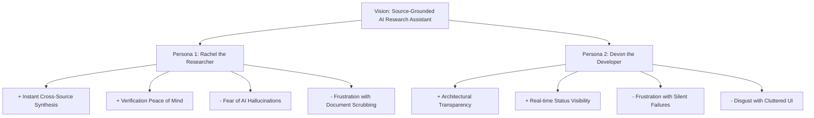

# Trigger Map: chaibookLM (chaiRAG)

> Connect business goals to user psychology — understand why users act, not just what they do.

**Created:** 2026-07-25  
**Phase:** 2 — Trigger Mapping  
**Agent:** Saga (Analyst)  
**Status:** Completed & Validated  

---

## 1. Business Goals & Vision

### Vision Statement
> *"To deliver a portfolio-grade, source-grounded AI research assistant that empowers knowledge workers to extract 100% traceable, cited answers across multi-format sources (PDFs, YouTube, Web, Text, VTT) without hallucinations or lost context."*

### SMART Objectives
1. **Multi-Format Ingestion Reliability:** Ingest and index 100% of valid files across 5 source formats within 5MB file & 50MB notebook caps.
2. **100% Citation Traceability:** Every generated answer contains interactive citations that reliably open the exact page, timestamp, or line highlight in the preview panel.
3. **Sub-2-Minute Time-to-Value:** A new user can create a notebook, ingest sources, and receive their first cited answer in under 2 minutes.

---

## 2. Target Personas & Driving Forces

### Persona 1: Rachel the Researcher (Primary Knowledge Worker)
* **Usage Context:** Juggles 10–50 mixed documents (PDFs, YouTube lectures, web articles, notes) for a single research project or report.
* **Positive Drivers (+):**
  - **Instant Cross-Source Synthesis:** Ask complex questions across 10+ files and receive immediate, structured answers.
  - **Verification Peace of Mind:** Know with 100% certainty that every claim is backed by a clickable, exact source citation.
* **Negative Drivers (-):**
  - **Fear of AI Hallucination:** Dread of relying on or citing false AI assertions in an important report.
  - **Frustration with Document Scrubbing:** Anxiety over wasting hours manually searching PDFs (Ctrl+F) and video timelines.

### Persona 2: Devon the Developer (Full-Stack / AI Evaluator)
* **Usage Context:** Reviewing portfolio projects or evaluating modern RAG architecture for clean design and implementation standards.
* **Positive Drivers (+):**
  - **Architectural Transparency:** Inspect clean, production-grade Next.js + Qdrant RAG patterns and citation UX.
  - **Real-Time Status Visibility:** See live feedback on document ingestion state (uploading → indexing → ready).
* **Negative Drivers (-):**
  - **Frustration with Silent Failures:** Annoyance when RAG apps fail silently or hide retrieval logic.
  - **Disgust with Cluttered UI:** Dislike for generic, un-themed templates without proper design system tokens.

---

## 3. Feature Impact Matrix

| Feature | Persona | Addressed Driver | Impact Rating |
| :--- | :--- | :--- | :---: |
| **Interactive Inline Citations (`[1]`, `[2]`)** | Rachel | 🔴 Fear of AI Hallucinations / 🟢 Verification | **P1 (Highest)** |
| **Source Preview Panel (PDF/YT/Text)** | Rachel | 🔴 Document Scrubbing Waste | **P1 (Highest)** |
| **Status Dot Animations (Yellow Pulse → Green Settle)** | Devon | 🔴 Silent Failures / 🟢 Status Visibility | **P1 (Highest)** |
| **Multi-Source Ingestion (PDF, YT, Web, Text, VTT)** | Rachel | 🟢 Cross-Source Synthesis | **P1** |
| **Isolated Notebook Workspaces** | Both | 🟢 Project Isolation | **P2** |
| **Configurable Env Variables (`MAIN`, `LITE`, `EMBEDDING`)** | Devon | 🟢 Architectural Transparency | **P2** |

---

## 4. Strategic Design Focus Statement

> *"chaibookLM's design must focus on empowering **Rachel the Researcher** to ingest multi-format sources and receive 100% verifiable, cited answers without fear of AI hallucinations or lost context, while providing **Devon the Developer** with transparent status animations, environment flexibility, and production-grade RAG architecture."*
