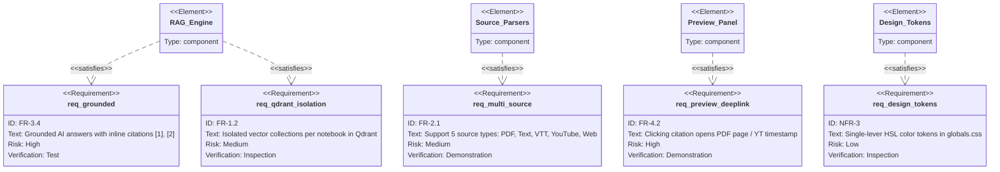
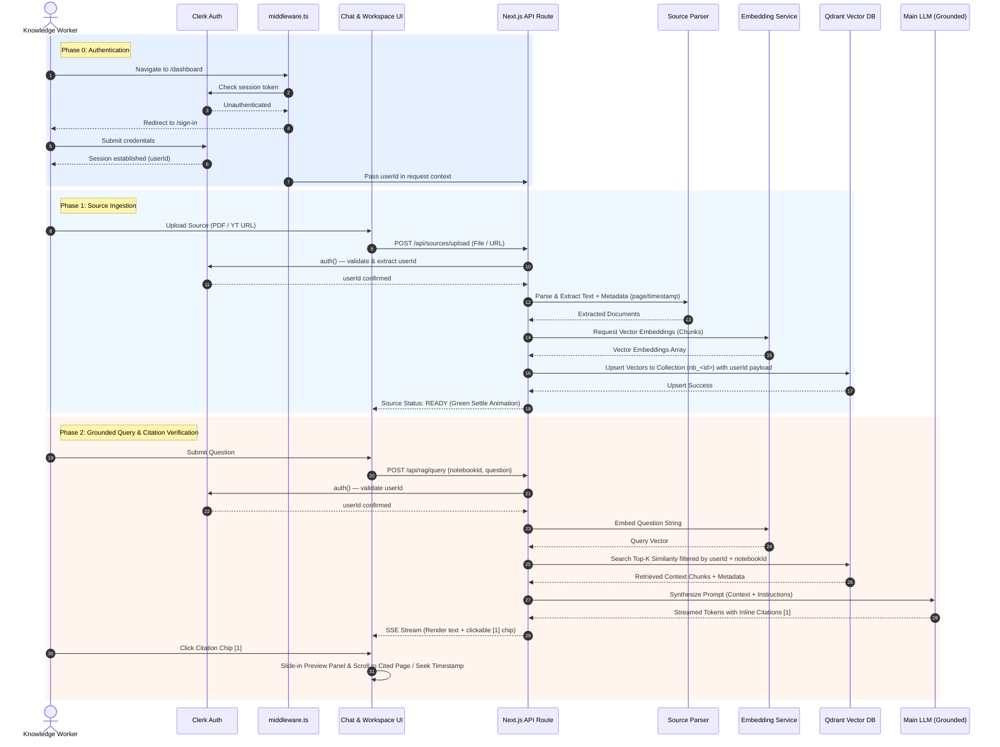
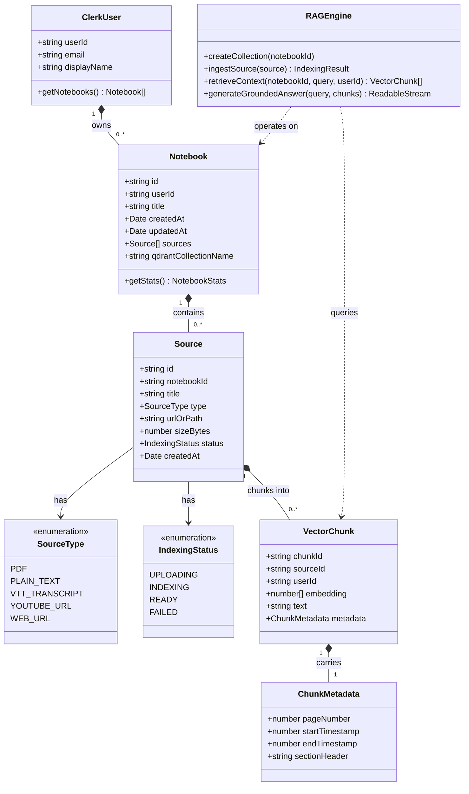
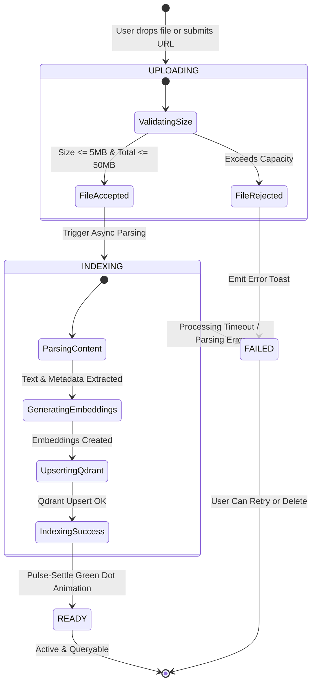
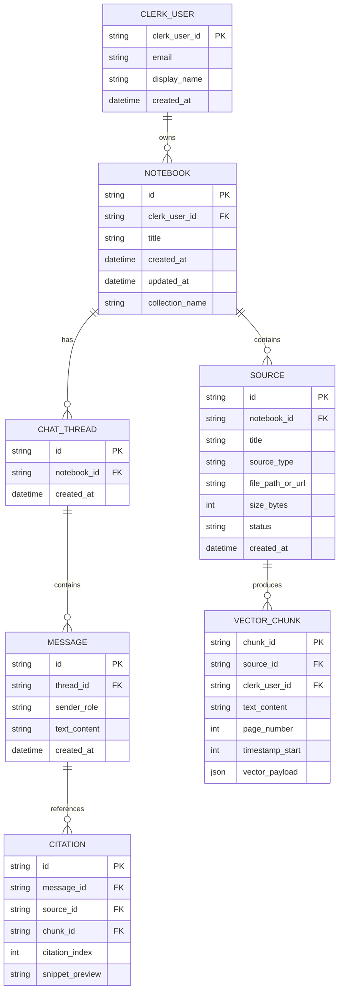

# Comprehensive UML Diagrams: chaibookLM

> Formal UML & Mermaid Architectural Diagrams covering system overview, sequence flows, data models, state transitions, ER entities, activity flows, and requirements.

**Created:** 2026-07-25  
**Phase:** 3 — UML Architecture  
**Author:** Technical Writer & Architect  

---

## 1. Project Working Overview Diagram

High-level architecture showing user interactions, Next.js App Router, RAG Engine, 3 LLM Model Tiers, and Qdrant Vector Store.

```mermaid
flowchart TB
    subgraph Client["Browser Client (React UI)"]
        UI_Nav["Navigation & Header (UserButton)"]
        UI_Dash["Notebook Dashboard"]
        UI_Workspace["3-Column Workspace"]
        UI_Sources["Source Manager"]
        UI_Chat["Chat Component"]
        UI_Preview["Source Preview Panel (PDF/YT/Text)"]
    end

    subgraph Auth["Clerk Authentication"]
        ClerkProvider["ClerkProvider (Root Layout)"]
        Middleware["middleware.ts (Route Protection)"]
        SignIn["<SignIn /> — /sign-in"]
        SignUp["<SignUp /> — /sign-up"]
        UserButton["<UserButton /> (Navbar)"]
    end

    subgraph Server["Next.js Server API Layer"]
        API_Auth["auth() — Clerk server helper"]
        API_Notebooks["/api/notebooks (userId-scoped)"]
        API_Upload["/api/sources/upload"]
        API_RAG["/api/rag/query (SSE Stream)"]
    end

    subgraph RAGCore["RAG Pipeline & Parsers"]
        Parsers["Parsers (PDF, VTT, YT, Web, Text)"]
        Chunker["Intelligent Chunker (500t / 50t overlap)"]
        VectorEngine["Qdrant Vector Client"]
    end

    subgraph LLM_Services["Configurable AI Services (.env)"]
        MainLLM["MAIN LLM (Grounded Synthesis)"]
        LiteLLM["LITE LLM (Summaries & Titling)"]
        EmbedModel["EMBEDDING Model (Vectorization)"]
    end

    subgraph Storage["Infrastructure"]
        Qdrant[("Qdrant Vector DB (Docker)")]
        LocalDB[("Local State / File Store (userId-keyed)")]
    end

    Client --> Middleware
    Middleware -->|Unauthenticated| SignIn
    Middleware -->|Authenticated| Server

    UI_Sources -->|Upload File / URL| API_Upload
    UI_Chat -->|Submit Natural Language Query| API_RAG
    UI_Dash -->|Create / Open Notebook| API_Notebooks

    API_Notebooks --> API_Auth
    API_Upload --> API_Auth
    API_RAG --> API_Auth
    API_Auth -->|userId| LocalDB

    API_Upload --> Parsers --> Chunker --> EmbedModel
    EmbedModel -->|Vector Chunks| VectorEngine --> Qdrant

    API_RAG -->|Similarity Search| VectorEngine
    Qdrant -->|Top-K Context Chunks| API_RAG
    API_RAG -->|Context + Prompt| MainLLM
    MainLLM -->|Streamed Tokens + Citations| UI_Chat

    UI_Chat -->|Click Citation [N]| UI_Preview
```

---

## 2. Requirement Diagram

Maps functional & non-functional requirements to system modules.



---

## 3. Sequence Diagram (Source Ingestion & Citation Querying)

Detailed sequence of interactions from file upload to streaming answer synthesis and citation deep-linking.



---

## 4. Class Diagram

Object-oriented representation of domain models, services, and parsers.



---

## 5. State Machine Diagram (Source Lifecycle)

State transitions for a source document through ingestion.



---

## 6. Entity Relationship (ER) Diagram

Database schema for relational index & vector payload relations.



---

## 7. Activity Diagram (Query & Source Viewer Navigation)

Step-by-step user and system flow during query execution and citation previewing.

```mermaid
flowchart TD
    Start([User Types Question in Workspace]) --> CheckSource{At Least 1 Source Ready?}
    
    CheckSource -- No --> PromptUpload[Display 'Add Source First' Tooltip & Input Disabled]
    PromptUpload --> End([Wait for Upload])

    CheckSource -- Yes --> SubmitQuery[Submit Query to API]
    SubmitQuery --> SearchVector[Qdrant Similarity Search in notebook collection]
    SearchVector --> SynthesizeAnswer[Stream Grounded Answer via MAIN LLM]
    SynthesizeAnswer --> RenderMessage[Render Streamed Message with Citation Pills [1], [2]]

    RenderMessage --> UserClick{User Clicks Citation Pill [1]?}
    UserClick -- No --> ContinueChat[User Continues Chatting]
    
    UserClick -- Yes --> OpenPreview[Slide Open Right Preview Panel]
    OpenPreview --> CheckType{Source Type?}

    CheckType -- PDF --> ScrollPDF[Render PDF & Jump to Page N]
    CheckType -- YouTube --> SeekYT[Render Player & Seek to Timestamp T]
    CheckType -- Text/VTT --> HighlightText[Render Text View & Highlight Line Segment]

    ScrollPDF --> Verify([User Verifies Claim in Original Source])
    SeekYT --> Verify
    HighlightText --> Verify
```
